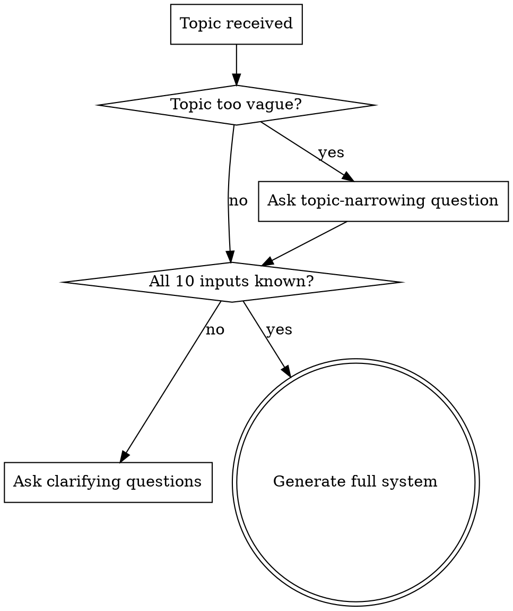

# LinkedIn Topic-to-Growth System

## Overview

Turns a single general topic into a complete, ready-to-use LinkedIn growth system:
strategy, content pillars, a dated posting calendar, full publish-ready posts, and an
image/carousel prompt for every post.

**Core principle:** Never produce a plan before you understand the user. The clarifying
questions are a hard gate. Every output must be specific to the user's topic, audience,
and goal — never generic motivational filler, never invented statistics.

**Language rule:** Strategy scaffolding, labels, and explanations may be written in the
user's language. **All publish-ready LinkedIn post copy (hooks, body, CTAs, hashtags,
engagement questions) MUST be written in Spanish**, unless the user explicitly requests
another language.

## When to Use

- "Help me grow on LinkedIn about [topic]"
- "Build me a 30-day LinkedIn content calendar"
- "Write LinkedIn posts about [topic]"
- "I want a personal-brand / authority strategy on LinkedIn"
- User gives a topic and wants posts + a plan + visuals

**When NOT to use:** single ad-hoc post with no strategy needed (just write it); platforms
other than LinkedIn; resume/CV writing.

## The Hard Gate: Ask Before You Plan



Do not skip the gate because the topic "seems clear." Missing answers force generic
content. If the user insists on skipping, proceed using documented defaults and **mark
every assumption explicitly** in an "Assumptions" block.

## Input Schema

The skill collects these inputs (see `references/clarifying-questions.md` for the exact
questions and why each is asked).

| Field | Required | Type | Default if skipped |
|-------|----------|------|--------------------|
| `topic` | ✅ | string | — (must ask) |
| `main_goal` | ✅ | enum: followers, clients, authority, recruiters, sell_product, educate, personal_brand | authority |
| `target_audience` | ✅ | string | inferred from topic (mark assumption) |
| `linkedin_level` | optional | enum: beginner, intermediate, advanced | intermediate |
| `posting_frequency` | optional | enum: daily, 3x_week, weekly | 3x_week |
| `tone` | optional | enum: professional, bold, educational, inspirational, technical, simple, storytelling | professional + educational |
| `depth` | optional | enum: beginner_friendly, expert, mixed | mixed |
| `formats` | optional | multi: text, carousel, image, poll, article, mixed | mixed |
| `offer` | optional | string | none / personal brand |
| `avoid` | optional | string | none |
| `period_days` | optional | int | 30 |

JSON shape:

```json
{
  "topic": "string (required)",
  "main_goal": "authority",
  "target_audience": "string (required)",
  "linkedin_level": "intermediate",
  "posting_frequency": "3x_week",
  "tone": ["professional", "educational"],
  "depth": "mixed",
  "formats": ["mixed"],
  "offer": "string | null",
  "avoid": "string | null",
  "period_days": 30
}
```

## Internal Workflow

Execute in order. Load the linked reference file only when you reach that step.

1. **Gate check.** If `topic` is vague, ask one narrowing question. Then ask any missing
   required inputs. See `references/clarifying-questions.md`. Wait for answers.
2. **Strategy Summary (A).** Positioning, audience angle, main message, differentiation,
   growth objective. Derive from inputs; mark assumptions.
3. **Content Pillars (B).** 4–6 pillars. See `references/content-pillars.md`.
4. **Chronogram (C).** Dated calendar table for `period_days`, frequency-aware, pillars
   rotated. See `references/chronogram.md`.
5. **Full Posts (D).** Publish-ready posts **in Spanish**. See
   `references/post-generation.md`. Run each through the quality gate.
6. **Image/Carousel Prompts (E).** One per post. See `references/image-prompts.md`.
7. **Growth Strategy (F).** Times, commenting, networking, repurposing, engagement loops,
   weekly metrics. See `references/growth-strategy.md`.
8. **Quality control (G).** Validate every post against
   `references/quality-checklist.md`. Fix failures before presenting.
9. **Assumptions block.** List every assumption made.

### Scaling output to volume

For long calendars (e.g., 30 days = many posts), do not silently truncate. Either (a)
write the full Strategy + Pillars + complete Chronogram, then full posts for the first
batch (e.g., week 1) and offer to continue, or (b) ask the user which posts to fully
draft first. Always state which posts are fully drafted vs. only scheduled.

## Topic Handling Rules

- **Technical topic:** explain clearly without oversimplifying; define jargon inline.
- **Science / math / economics / AI / physics:** balance accuracy with accessibility; do
  not dumb down to the point of being wrong.
- **No invented facts.** Never fabricate statistics, studies, or quotes. If a claim would
  strengthen a post, either source it honestly or reframe as the author's reasoning/
  experience and label it as such.
- **Respect `avoid`.** Never produce a topic, claim, style, or format the user excluded.

## Output Format

Present with clear headings A–G, tables for the chronogram and image prompts, and each
LinkedIn post in a fenced, ready-to-copy block. End with the Assumptions block and a
short "what to do next" line. See `examples/example-session-es.md` for a worked example.

## Red Flags — Stop and Correct

- About to generate a calendar without having the required inputs → ask first.
- Writing a post in English → switch to Spanish.
- Inserting a statistic you can't source → remove or reframe.
- Producing a generic "Monday motivation" post the user didn't ask for → make it specific.
- Every post starts the same way → vary hooks and formats.
