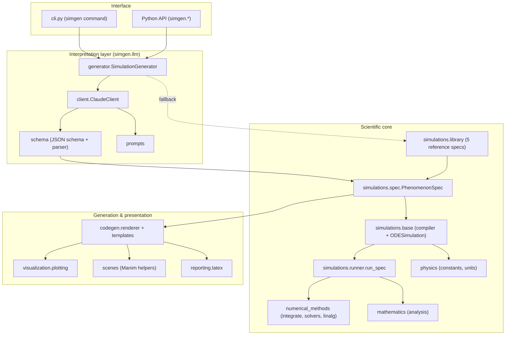

# Architecture Diagram

High-level component architecture of `simgen`.

## Layers

- **Interface** — the `simgen` CLI and the importable Python API.
- **Interpretation** — converts prompts to a validated `PhenomenonSpec` (Claude
  API), with the offline library as a fallback.
- **Scientific core** — the spec model, the spec→simulation compiler, the
  integrators, and the analysis/constants utilities.
- **Generation & presentation** — renders the spec into standalone code, plots,
  Manim scenes and LaTeX reports.

The `PhenomenonSpec` is the contract that every layer shares, guaranteeing that
all artifacts describe the same model.
