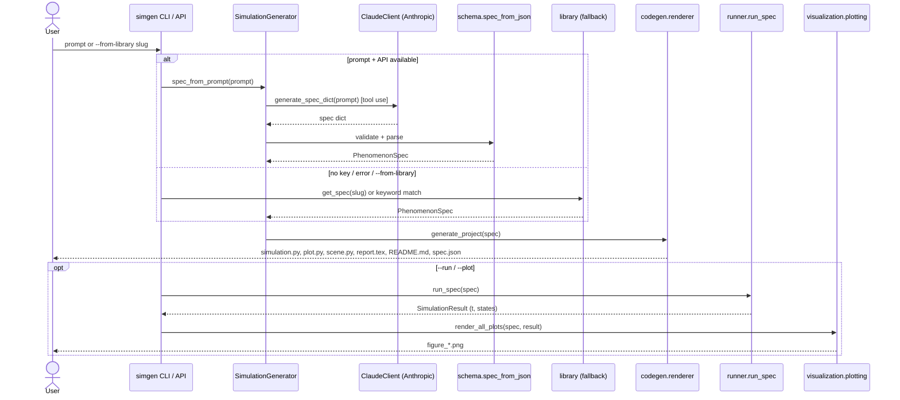

# Data Flow Diagram

How data moves from a prompt to finished artifacts.

## Key data structures

| Stage | Data |
|-------|------|
| Prompt | free text |
| Model output | JSON dict matching `SPEC_JSON_SCHEMA` |
| Parsed | `PhenomenonSpec` (validated) |
| Generated | files on disk + `spec.json` |
| Run | `SimulationResult` (`t`, `states`, `symbols`) |
| Plotted | PNG figures |

The `PhenomenonSpec` is serialised to `spec.json` in every generated project, so
the exact inputs are always recoverable and the pipeline is reproducible.
