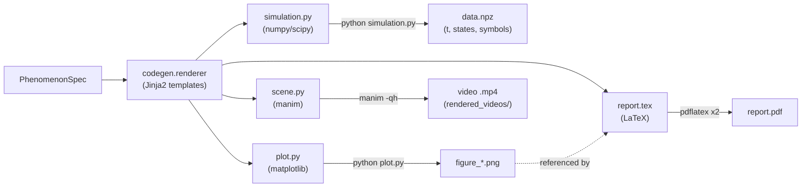

# Rendering Pipeline Diagram

From a `PhenomenonSpec` to the four artifact types and their final outputs.

## Artifact dependencies

- `plot.py` and `scene.py` both `import simulation` (same directory) to obtain
  the trajectory via `simulate()`.
- `report.tex` references `figure_*.png` through `\IfFileExists`, so it compiles
  whether or not the figures have been generated yet.
- Each artifact is **standalone**: generated projects depend only on
  NumPy/SciPy/Matplotlib (and Manim for the animation), never on `simgen`.

## Tooling per stage

| Artifact | Tool | Command |
|----------|------|---------|
| `simulation.py` | Python + NumPy/SciPy | `python simulation.py` |
| `plot.py` | Matplotlib (Agg) | `python plot.py` |
| `scene.py` | Manim + FFmpeg + LaTeX | `manim -qh scene.py <Class>Scene` |
| `report.tex` | pdfLaTeX | `pdflatex report.tex` (×2) |
