# Why a Skellam Distribution Beats a Score Grid

## The statistical backbone of a World Cup forecaster — and the calibration bug that hid inside a 5×5 matrix

**Estimated reading time:** ~12 minutes

**SEO keywords:** Skellam distribution, Poisson football model, Dixon-Coles, Elo rating, soccer prediction, probability calibration, Bayesian shrinkage, James-Stein estimator

**Medium tags:** Data Science, Machine Learning, Statistics, Sports Analytics, Mathematics

---

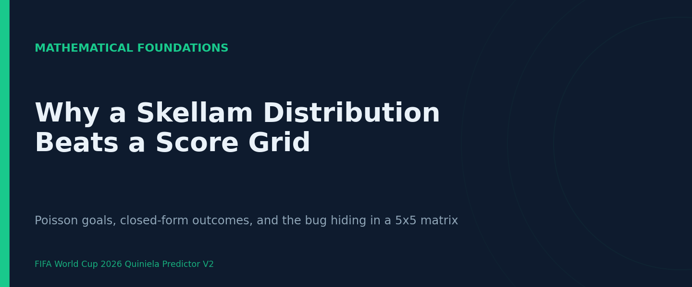

### Introduction

Predicting international football is a small-data problem wearing a big-data costume. A
national team plays only 8–15 official matches a year, its roster turns over between every
call-up, and the strength of its schedule depends on which confederation it happens to live
in. The usable history for the 2026 World Cup forecaster described here is on the order of
10^4 matches total — tens, not thousands, per relevant team. That single fact rules out
deep learning and pushes you straight into the arms of **structural statistical models**:
Poisson processes for goals, Bradley–Terry/Elo systems for team strength, and a thin layer
of gradient boosting on a handful of engineered features.

This is not a limitation to apologize for. It is the regime in which the published literature
on tournament forecasting actually lives — Maher (1982), Dixon & Coles (1997), Karlis &
Ntzoufras (2009), Groll et al. (2015, 2019). The interesting engineering question is not
"which neural architecture," but "which generative assumption about goals, and how do I turn
it into well-calibrated probabilities over the three outcomes Home / Draw / Away?"

The most consequential mathematical decision in this system answers exactly that question,
and it is counterintuitive: to get H/D/A probabilities, **do not** integrate over a matrix
of scorelines. Use the Skellam distribution instead. This article explains why — and tells
the story of the orientation bug that lived inside the scoreline matrix and silently dragged
an entire Monte-Carlo simulation toward the wrong teams.

### Background Theory

#### Goals as a Poisson process

The foundational assumption, due to Maher (1982), is that the number of goals a team a
scores against team b is Poisson-distributed:

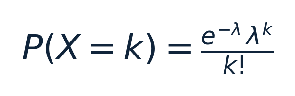

(for k = 0, 1, 2, …)

with a rate parameter built multiplicatively from an attack strength, a defence strength, a
global scoring rate, and home advantage:

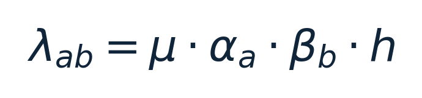

The intuition is clean: goals are rare, independent-ish events accumulating over 90 minutes,
which is the textbook setting for a Poisson count. The strength parameters α_a and
β_b are estimated from weighted marginal averages of goals scored and conceded; μ
from the global weighted average; h from the home/away differential.

The assumption has two well-known cracks. First, **goals are not truly independent** between
the two teams — a side chasing a game changes both scoring rates at once. Dixon & Coles (1997)
patched this with a low-score correction factor τ(λ_a, λ_b, ρ) applied
only to the {0-0, 1-0, 0-1, 1-1} cells:

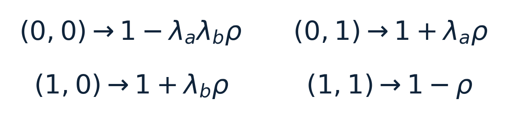

Second, the Poisson is **stationary**, and football is not — a result from four years ago
should not count as much as one from last month.

#### From scorelines to outcomes: two roads

Once you have λ_a and λ_b, you need P(H), P(D), P(A).
There are two ways to get there.

**Road 1 — the score grid.** Form the outer product of the two marginal Poisson PMFs into a
matrix M where M[i,j] = P(G_a = i, G_b = j), apply the Dixon-Coles correction to the four
low cells, then sum the triangles:

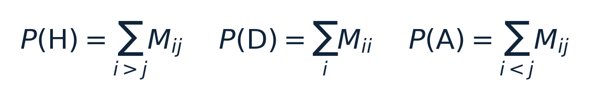

This works, but it is fiddly. You truncate the grid at some max score, you renormalize after
the τ correction, and — crucially — **you have to keep the orientation straight.** Home
wins live on the *lower* triangle (i > j, team_a scored more). Get that backwards and every
probability is mirrored.

**Road 2 — the Skellam distribution.** Here is the elegant move. If
G_a ~ Poisson(λ_a) and G_b ~ Poisson(λ_b) are independent,
then the *goal difference* D = G_a - G_b has a closed-form distribution on all of
ℤ, the Skellam (1946):

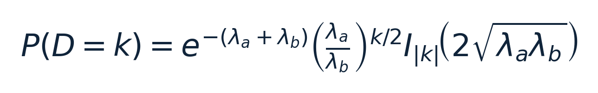

where I_(|k|) is the modified Bessel function of the first kind. The three outcomes fall out
directly from its CDF, with **no matrix, no truncation, no renormalization**:

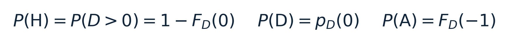

In code this is three calls to `scipy.stats.skellam`. Karlis & Ntzoufras (2009) showed this
path **calibrates draws better** than the ad-hoc τ correction — and draws are exactly
where football models are most prone to underconfidence.

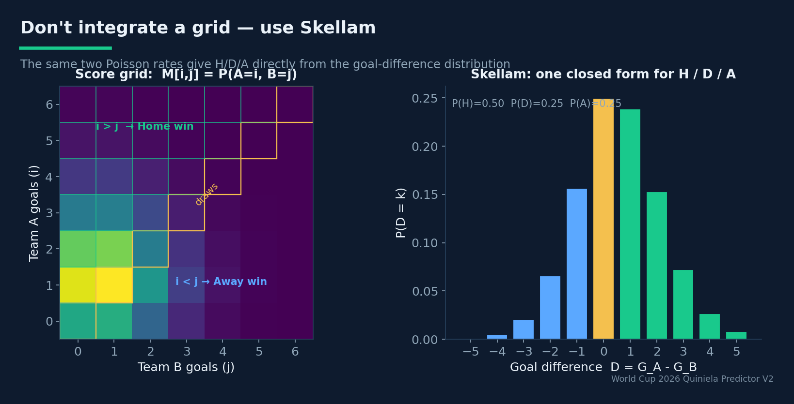
*Two Poisson rates, two roads to H/D/A: integrate the score grid (left) or read the outcomes straight off the Skellam goal-difference distribution (right). The grid's lower triangle is home wins — invert it and every probability mirrors.*

So why keep the grid at all? Because a quiniela also rewards predicting the *exact scoreline*,
and only the grid gives you P(G_a = i, G_b = j) per cell. The system therefore runs a hybrid:
**Skellam for H/D/A** (the default, controlled by a `use_skellam` flag), **Dixon-Coles grid for
exact scorelines**. Best tool for each question.

#### Team strength: three orthogonal ratings

Probabilities are only as good as the strength estimates feeding λ. The system blends
three rating systems precisely because each captures a different axis of "strength."

**Elo** (Elo, 1978) is the long-memory, symmetric backbone:

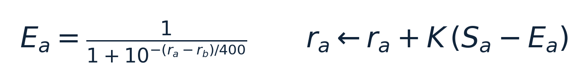

Three domain-specific extensions matter here. The learning rate K is **competition-aware**:
K = 80 for World Cup matches, K = 8 for friendlies. This is a deliberate recalibration
(June 2026: friendlies dropped from 18 to 8, World Cup raised from 60 to 80) to stop
rotation-heavy friendlies from injecting noise while letting the tournament itself move
ratings hard. A **goal-margin multiplier** m(g) scales the update by blowout size, and an
**exponential time decay** w_t = exp(-ξ Δ_(days)) with ξ ≈ 0.0015
(half-life ≈ 462 days) down-weights stale results — the same Dixon-Coles idea, applied to the
rating update.

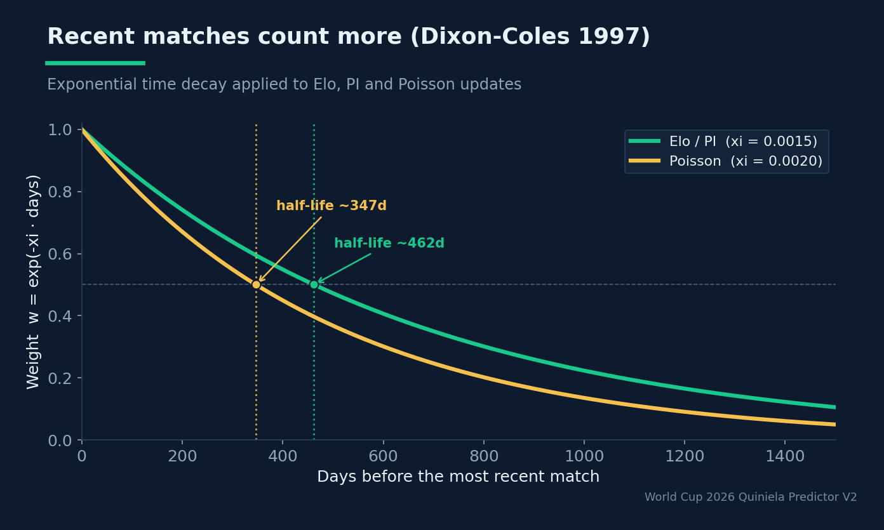
*Exponential time decay down-weights stale results. Elo/PI use xi = 0.0015 (half-life ~462 days); the Poisson model uses xi = 0.0020 (half-life ~347 days).*

**PI rating** (Constantinou & Fenton, 2013) adds what Elo cannot represent: **home/away
asymmetry**. It keeps two ratings per team and two learning rates (λ = 0.054 intra-,
γ = 0.79 cross-condition), updating on the discrepancy between observed and expected
goal difference.

**Rolling form** captures momentum: points plus a fraction of goal difference over the last
5 matches.

The three are combined by z-scoring each and taking a weighted average,

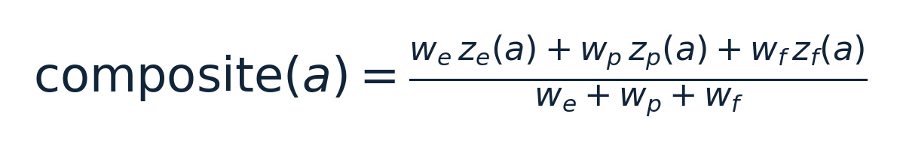

with weights (0.55, 0.30, 0.15). The z-score is the load-bearing step: it puts three
incommensurable scales into a common unit so the average is meaningful, and averaging
orthogonal signals reduces estimator variance (Dietterich, 2000).

#### Taming small samples: James–Stein shrinkage

Here the physics-minded reader should perk up. With ~10 matches a year, the
maximum-likelihood rating of a minnow that happened to beat weak confederation rivals is a
**high-variance** estimate — it looks far stronger than it is. James & Stein (1961) proved
something that still feels paradoxical: shrinking such estimates toward a common prior is
*admissible* — it strictly reduces risk under squared error. The system applies

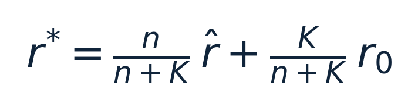

where r_0 is a **confederation prior** (UEFA/CONMEBOL = 1620, CONCACAF = 1430, AFC = 1400,
CAF = 1420, OFC = 1200) and K controls shrinkage strength. A team with little history is
pulled hard toward its confederation's mean; a team with a long record keeps its empirical
rating. This directly counteracts the strength-of-schedule distortion that otherwise inflates
teams from weak pools.

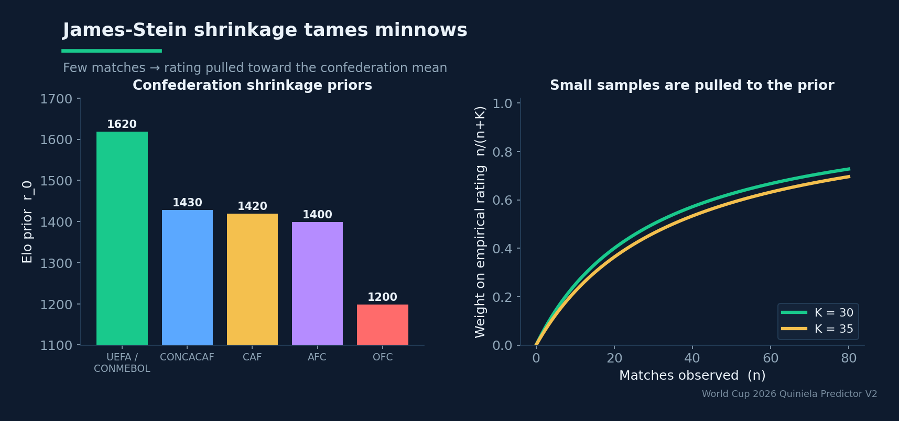
*Left: the Elo prior each confederation is shrunk toward. Right: the weight on a team's own empirical rating, n/(n+K) — teams with few matches are pulled hard toward the prior.*

### System Design / Methodology

The probability pipeline is a clean composition of the pieces above:

1. **Ratings** (`src/ratings/`) compute the composite strength index, with optional time
   decay and shrinkage.
2. **Feature engineering** (`src/features/`) turns the canonical match table into ~25
   covariates — rating differentials, FIFA-ranking gaps, fatigue/travel proxies, and the
   squad-value differences described below.
3. **Outcome models** (`src/models/`) each emit a probability vector over {H, D, A}: a
   multinomial logistic regression, an XGBoost classifier, and the Poisson/Skellam model.
4. **Blending** (`src/ensemble/blender.py`) takes a weighted average of the available models'
   probability vectors and renormalizes.
5. **Calibration** (`src/models/calibration.py`) applies a per-class isotonic (or Platt)
   transform fitted on a temporal validation slice.

Two design choices deserve emphasis. First, **LASSO feature selection** (Tibshirani, 1996;
Groll et al., 2015) runs an L1-penalized multinomial logistic regression over the full feature
pool *before* the main models are fit, dropping any feature whose coefficient is zero across
all three classes (with a floor of 5 features so it can't over-prune). Several engineered
features are deliberately redundant — `volatility_index` and `match_entropy` are both
tanh(Δ_(elo)/250) in disguise — and L1 is the principled way to let the data
decide which survive.

Second, **squad value as a talent signal**. Elo and PI are *results-based*: they reward what
already happened and react late when a powerhouse rotates its squad or hits a rough patch.
Following Groll et al., the system adds Transfermarkt market values (via the Kaggle
`player-scores` dataset), aggregated by citizenship **as of the match date**, as
Δ = log(1 + v_a) - log(1 + v_b) for both total and top-11 value. The as-of join is
what makes it honest: each match sees only valuations that existed before it.

### Experiments and Results

How do you know the Skellam path and the squad-value features actually help? Not by eyeballing
the championship table — *by held-out log-loss in a leakage-free cross-tournament backtest*
(the subject of a companion article). The numbers the project records:

- Adding squad value moved held-out log-loss from **0.9994 → 0.9905**, Brier **0.1976 →
  0.1955**, ordinal RPS **0.2117 → 0.2082** on the 2018 + 2022 tournaments, with accuracy
  unchanged. Both squad-value features survived LASSO (importances ≈ 0.05 / 0.04).
- The production baseline sits at log-loss **≈ 0.99** against a uniform baseline of
  ln 3 ≈ 1.0986 — a real but humble edge, exactly what the literature predicts for
  this domain.

The most instructive result, though, is a **bug**, not a metric. The Poisson `outcome_proba­bilities`
function once had its triangles inverted — home wins read off the *upper* triangle instead of
the lower. Because Poisson carried roughly half the effective weight in the blended simulator,
this silently routed probability mass to the wrong team in every single match. The visible
symptom was surreal: Paraguay, Panama and Iraq outranking Spain and Brazil for the title. The
lesson is that **a probabilistic bug does not crash** — it produces confident, plausible-looking
nonsense. The only defenses are an explicit, documented orientation invariant
(`matrix[i,j] = P(team_a scores i, team_b scores j)`, home wins on `i > j`) and a backtest that
would have flagged the calibration collapse.

> **A probabilistic bug does not crash — it produces confident, plausible-looking nonsense.** The only defenses are an explicit invariant and an out-of-sample check.

### Lessons Learned

- **Closed forms beat grids when a closed form exists.** Skellam removed truncation,
  renormalization, *and* an entire class of orientation bugs, while calibrating draws better.
  Mathematical elegance here was also an engineering risk reduction.
- **Hybridize by question, not by dogma.** Skellam for outcomes, Dixon-Coles grid for exact
  scorelines. There was no need to pick one globally.
- **Orthogonality is the point of an ensemble.** Elo (long-term, symmetric), PI (home/away),
  form (momentum), and squad value (talent) each see something the others miss. Z-scoring
  makes them addable; averaging makes them stable.
- **Shrinkage is not optional in small-sample regimes.** Without James–Stein pulling minnows
  toward confederation priors, strength-of-schedule artifacts dominate.
- **Probabilistic bugs are silent.** They demand invariants and out-of-sample checks, because
  the code will happily run and lie.

### Future Work

The documented roadmap is honest about what is missing. A **bivariate Poisson with an explicit
covariance parameter** (Karlis & Ntzoufras, 2003) would model the goal-dependence that even
Skellam assumes away. A **bookmaker-consensus prior** — averaging ≥10 de-overrounded odds in
logit space (Leitner–Zeileis–Hornik, 2010) — is the single most-cited benchmark in the field
and remains unimplemented. And the squad-value proxy, currently by citizenship, could be
sharpened by reconstructing real historical call-ups.

### Conclusion

The mathematical core of this forecaster is a study in disciplined restraint. Faced with a
small-data, high-variance domain, it reaches for generative structure (Poisson goals), a
closed-form shortcut where one exists (Skellam outcomes), orthogonal strength signals
(Elo/PI/form/squad value), and a classical variance-reduction tool (James–Stein shrinkage) —
not for architectural novelty. The payoff is a model whose every assumption is legible, whose
failures are diagnosable, and whose modest edge over uniform is *real* because it was measured,
not assumed. In a domain this noisy, that legibility is the competitive advantage.
