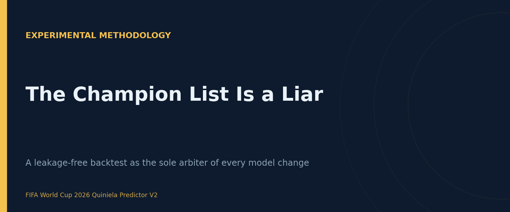
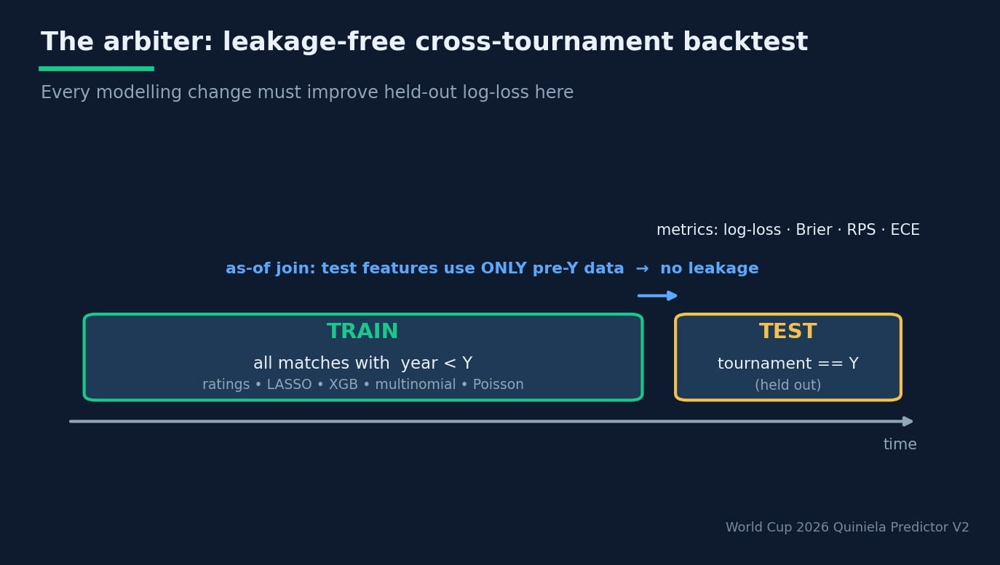
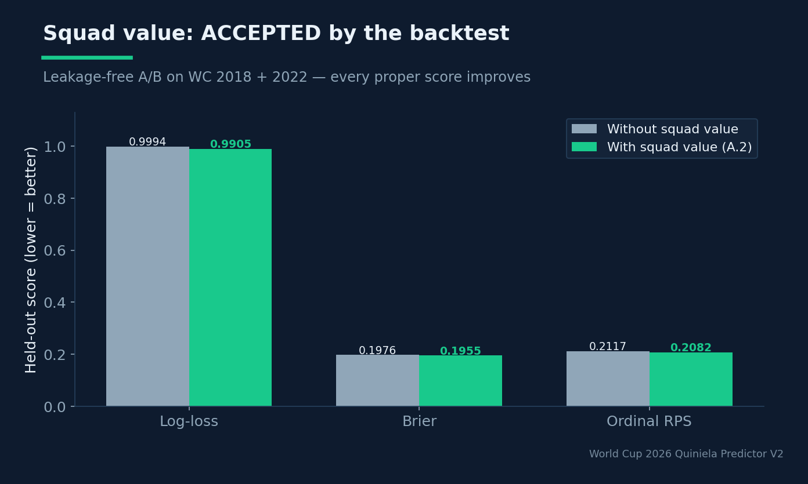
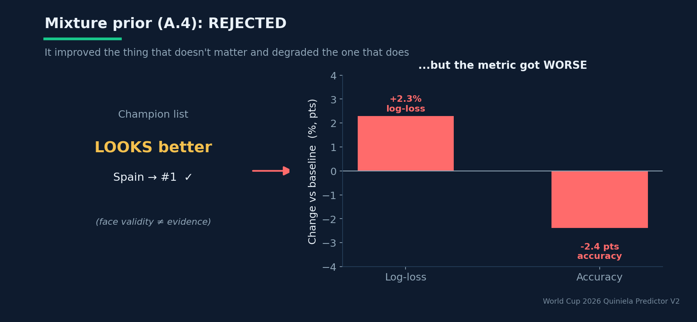

# The Champion List Is a Liar

## Building a leakage-free cross-tournament backtest as the sole arbiter of every model change

**Estimated reading time:** ~13 minutes

**SEO keywords:** backtesting machine learning, data leakage, cross-validation time series, model evaluation, log-loss, ranked probability score, sports forecasting, as-of join

**Medium tags:** Machine Learning, Data Science, MLOps, Model Evaluation, Sports Analytics

---



### Introduction

Every modeler has felt the pull. You tweak a prior, re-run the pipeline, and the output
*looks* better — Spain is now first, Brazil is back in the top five, the list of likely
champions finally matches your footballing intuition. It feels like progress. It is, in fact,
the single most dangerous moment in an applied ML project, because **face validity is not
evidence**, and the metric that actually matters may have just gotten worse.

This is the central methodological story of the FIFA World Cup 2026 forecaster, and it is more
broadly applicable than any single equation in it. The team running the project wrote it down
bluntly in their own engineering notes: *"the championship list is misleading."* A team that
over-performs its talent (say, Morocco after a great run) rises to #1 on merit of results; a
powerhouse in a bad stretch (Brazil) sinks. That is **not a bug** — it is the honest output of
a results-based rating. The realism of the champion list tells you nothing about whether your
per-match probabilities improved. Only a proper backtest does.

So they built the backtest, made it the law, and let it overrule their own intuition. This
article is about that backtester: why it has to be leakage-free, how the leakage is actually
prevented, what metrics it reports, and the two real verdicts it delivered — one acceptance,
one rejection — that no amount of eyeballing the champion table would have gotten right.

> **Face validity is not evidence.** The most realistic-looking output and the best-calibrated model are different objects — and they can move in opposite directions.

### Background Theory

#### Why ordinary cross-validation lies in tournaments

Standard k-fold cross-validation shuffles rows into folds. For football this is catastrophic,
for two reasons.

**Temporal leakage.** A rating system is a stateful, cumulative object: a team's Elo today
encodes every prior result. If your training set contains matches from *after* a test match,
the ratings carry information from the future into the past. The model looks brilliant in
validation and collapses in production.

**Tournament structure leakage.** Even a naive time split can leak if features for a test
match are computed from a dataframe that includes the test tournament. The squad-value feature
is the obvious trap: use a 2022 valuation to "predict" a 2018 match and you've smuggled the
answer in.

The correct evaluation protocol for this domain is **cross-tournament, leakage-free
backtesting**: pick a target tournament year Y, train the *entire stack* only on matches
with year < Y, and evaluate on the matches of tournament Y — with the strict guarantee
that ratings and features for the test set are derived only from pre-Y data.

#### The metrics that matter (and why accuracy isn't one of them)

Accuracy — did `argmax(p)` match the result? — is almost useless here. Football outcomes are
genuinely uncertain; a perfectly calibrated model is wrong on a huge fraction of matches by
construction. What you care about is whether the *probabilities* are honest. The backtester
reports a battery of proper and diagnostic scores:

- **Log-loss** (the headline): -Σ_i log p̂_(i,y_i). A strictly proper scoring rule —
  it is minimized in expectation only by the true probabilities, and it punishes confident
  wrong calls brutally. The uniform baseline is ln 3 ≈ 1.0986.
- **Brier score** (multiclass): mean squared error over the probability simplex. Also proper,
  less sensitive to the tails than log-loss.
- **Ordinal RPS** (Ranked Probability Score; Constantinou & Fenton, 2012): the *right* metric
  for ordered outcomes. On the scale [H, D, A] it penalizes predicting
  a Home win when it was an Away win (a two-category miss) more than predicting a Draw
  (a one-category miss). Outcome ordinality matters and RPS is the only listed metric that
  respects it.
- **ECE** (Expected Calibration Error): bins predictions by confidence and measures the gap
  between confidence and empirical accuracy in each bin — a direct readout of calibration.
- **Accuracy** and **macro-F1**: reported, but as context, not as the decision criterion.

The choice to anchor decisions on **held-out log-loss** rather than accuracy or face validity
is the whole philosophy in one line.

### System Design / Methodology

#### The arbiter, in pseudocode

The cross-tournament backtester (`src/training/backtester.py::run_tournament_backtest`, driven
by `scripts/backtest_tournaments.py`) implements exactly the leakage-free protocol:

```
for each target year Y:
    train  = matches with year < Y
    test   = matches of the tournament == Y
    ratings = RatingEnsemble(shrinker).fit(train)          # only prior history
    feats   = build_match_feature_matrix(train ∪ test, ..., squad_values)   # as-of join
    models  = Trainer.fit(train_feats)                     # LASSO + XGB + multinomial + Poisson
    proba   = blend(ratings, models)(test_feats)
    metrics(Y) = log_loss, brier, ordinal_RPS, accuracy, ECE
```

The subtlety is in the line that builds features over `train ∪ test`. That looks like leakage —
and it would be, except every time-sensitive feature is computed with an **as-of join**. For a
match on date d, the squad-value feature takes, per team, the snapshot with the largest
`as_of_date` ≤ d (a `pd.merge_asof` with `by="team"`, direction `backward`). A 2018 match
sees only valuations that existed by 2018. The ratings, separately, are fit on `train` alone
and only *applied* to the test rows. Both channels are date-aware, so the union is safe.


*Train the full stack on everything before year Y; evaluate on the held-out tournament Y. An as-of join guarantees test features use only pre-Y data — no leakage.*

Running it is a one-liner:

```bash
python scripts/backtest_tournaments.py --years 2018 2022
# -> outputs/diagnostics/backtest_WC_2018_2022.csv
```

#### The governance rule

The decisive design decision is not the code — it is the **rule** wrapped around it: *any
modelling change (blend weights, the Elo K, a mixture prior, a new feature) is accepted only
if it improves held-out log-loss here.* Not if the champion list looks more realistic. Not if
intuition approves. The backtest is the arbiter, full stop. This converts modelling from
taste-driven tinkering into a hypothesis-test loop with a pre-committed acceptance criterion —
the experimental discipline of a lab notebook applied to ML.

A companion utility, `collect_holdout_predictions(matches, year)`, returns the raw
`(proba, y_true)` pairs for one tournament, which feed a **leakage-free reliability diagram**
and ECE in the analysis notebooks — calibration you can actually trust because it was never
fit on the data it's drawn over.

It is worth distinguishing this cross-tournament protocol from the system's other, more
conventional evaluator: a **rolling-origin** backtester that produces folds with growing
training windows and fits a model on each. Rolling-origin is the right tool for league-style
data where matches arrive in a steady stream; it respects time order but treats every match as
an interchangeable test point. The cross-tournament backtester is purpose-built for the actual
question — *how well will we forecast an entire World Cup we have never seen?* — by holding out a
whole tournament as the test unit and rebuilding the full stack from scratch on its past. Two
backtesters for two questions is itself a small piece of evaluation discipline: the granularity
of your held-out unit should match the granularity of the prediction you actually ship.

A second design subtlety is the **temporal validation slice** used by the calibrator. The
isotonic transform is fit on the last full calendar year before the tournament, which keeps it
out of the base classifier's training window — but the project is candid that this guarantee
should be enforced by an explicit assertion (`set(train.index) ∩ set(val.index) == ∅`) rather
than trusted implicitly. Naming the residual risk instead of papering over it is exactly the
posture that makes the rest of the evaluation credible.

### Experiments and Results

The backtester earned its keep by delivering two verdicts that contradicted intuition in
opposite directions.

**Verdict 1 — Squad value: ACCEPTED.** The hypothesis (well-supported by Groll et al.) was
that market value captures *current talent* that a results-based rating misses. The A/B on
2018 + 2022 was unambiguous:

| Metric    | Without squad value | With squad value |
|-----------|---------------------|------------------|
| Log-loss  | 0.9994              | **0.9905**       |
| Brier     | 0.1976              | **0.1955**       |
| Ordinal RPS | 0.2117            | **0.2082**       |
| Accuracy  | (unchanged)         | (unchanged)      |


*Adding squad value improves every proper score on the held-out 2018 + 2022 tournaments — while accuracy stays flat.*

Note that accuracy *did not move*. A team relying on accuracy would have concluded the feature
was useless. Log-loss, Brier and RPS all improved, and both squad-value features survived LASSO
with non-trivial importance. The feature shipped, enabled by default.

**Verdict 2 — Elite/regular mixture prior (A.4): REJECTED.** Baio & Blangiardo (2010) suggest
splitting each confederation's shrinkage prior into an *elite* and a *regular* tier rather than
pulling every team toward one mean. It was fully implemented and unit-tested. And it made the
champion list look *better* — with hand-tuned elite/regular priors, Spain rose to #1, exactly
the "realism" everyone wanted. The backtest said no: log-loss **+2.3%**, accuracy **−2.4
points**. It improved the thing that doesn't matter (face validity) and degraded the thing that
does (per-match calibration). The verdict was recorded verbatim and the feature was left
`enabled: false` by default, with a written instruction not to re-enable it without re-tuning
the priors *with an optimizer* and re-validating.


*The mixture prior made the champion list look better (Spain #1) while making held-out log-loss worse (+2.3%) and accuracy worse (−2.4 pts). It improved the thing that doesn't matter.*

These two results are the entire argument for the backtester in microcosm. Intuition said
"squad value, meh; mixture prior, yes." The data said the exact opposite on both.

A third, quieter result: once the backtest existed, sweeping the blend weights (ratings
0.25 → 0.35, Poisson 0.25 → 0.15) and the Poisson shrinkage K (20 → 35) came back **neutral**
in log-loss. They were applied anyway (they helped the champion list cosmetically and cost
nothing on the metric), but the real lesson was deflating and valuable: *the knobs were already
near-optimal.* The lever for real improvement was no longer tuning — it was orthogonal signal
(squad value), which is why that became the priority.

### Lessons Learned

- **Face validity is a trap.** The most realistic-looking output and the best-calibrated model
  are different objects, and they can move in opposite directions. The mixture-prior episode is
  the proof.
- **Pick the metric before you run the experiment.** Committing to held-out log-loss *in
  advance* is what made it impossible to rationalize the mixture prior back in.
- **Accuracy hides real gains.** Squad value left accuracy flat while improving three proper
  scores. If accuracy had been the gate, a good feature dies.
- **Leakage prevention is mechanical, not aspirational.** The as-of join and the
  fit-on-train/apply-on-test rating split are concrete, testable mechanisms — not a promise to
  be careful.
- **A good backtest tells you when to stop tuning.** Discovering the knobs were already optimal
  redirected effort from fiddling to feature acquisition — arguably the highest-ROI insight the
  project produced.
- **Ordinal outcomes deserve ordinal metrics.** RPS, not plain log-loss alone, respects that
  Home/Draw/Away is an ordered scale.

### Future Work

The honest gap the project names is the **bookmaker-consensus benchmark**. The forecasting
literature is unanimous (Leitner–Zeileis–Hornik, 2010; Zeileis, 2018) that the de-overrounded
average of ≥10 bookmakers, blended in logit space, is the benchmark almost no model beats by
more than 1–2% log-loss. Without consuming odds, the backtester can rank *its own* variants but
cannot tell you whether the whole system beats the market — *"if the model doesn't beat the
consensus in log-loss, the consensus is your model."* Adding that benchmark is the natural next
step (`compare_against_bookmaker` is already sketched in the roadmap). A smaller, trivial
improvement: an explicit assertion that the calibrator's fit set and the base classifier's
training set are disjoint, closing the last theoretical leakage gap by construction.

### Conclusion

The most valuable artifact in this project is not a model — it is a *referee*. A leakage-free,
cross-tournament backtester, wrapped in a pre-committed acceptance rule (improve held-out
log-loss or it doesn't ship), turned a noisy modelling effort into something closer to science.
It accepted a feature that intuition undervalued, rejected a prior that intuition loved, and
revealed that the tuning knobs were already spent. The broader lesson generalizes far beyond
football: in any domain where outputs are plausible enough to fool you, the discipline that
separates engineering from astrology is building the arbiter *first* — and then being willing to
let it overrule you.
