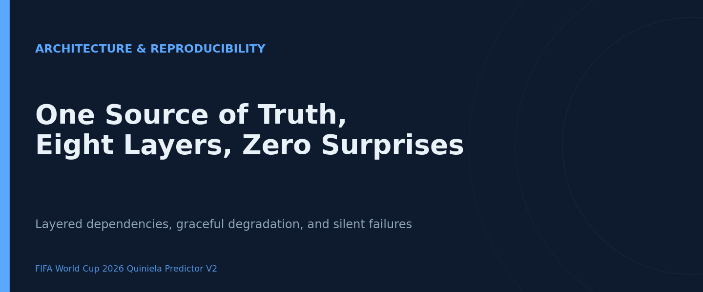
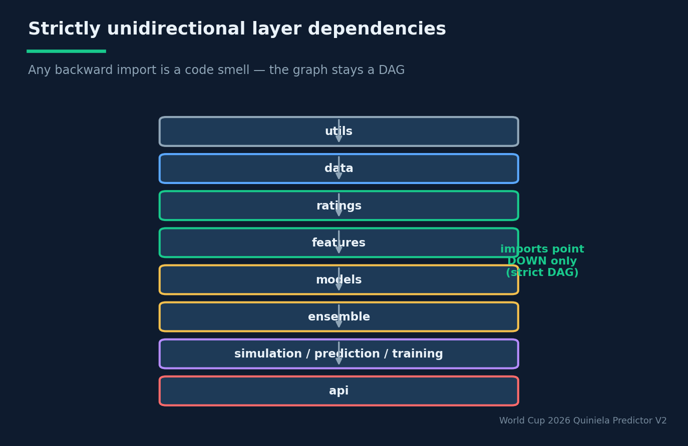
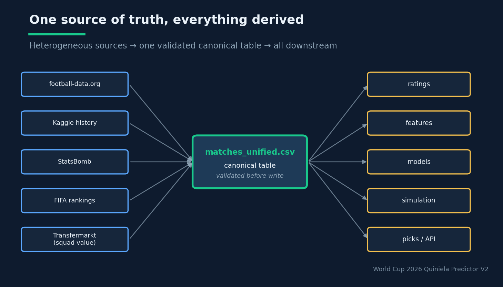

# One Source of Truth, Eight Layers, Zero Surprises

## Engineering a reproducible ML system — and the config that silently did nothing for months

**Estimated reading time:** ~12 minutes

**SEO keywords:** ML system architecture, reproducibility, layered architecture, single source of truth, MLOps, graceful degradation, pickling pitfalls, data pipeline design

**Medium tags:** MLOps, Software Engineering, Machine Learning, Data Engineering, System Design

---



### Introduction

Most machine-learning systems do not die from a bad model. They die from architecture — from
a feature that silently became NaN after a `dropna`, a config knob nobody noticed was never
read, a model artifact that won't unpickle, a pipeline stage that quietly recollected data and
overwrote the file everything else depended on. The modelling is the part you publish papers
about; the architecture is the part that determines whether your numbers are reproducible next
Tuesday.

The FIFA World Cup 2026 forecaster is a 60-module Python system that runs an entire ETL → ratings
→ features → models → ensemble → simulation pipeline end-to-end, then re-runs it every matchday
during the tournament. It is, by design, the kind of system that should be boring to operate.
This article is about the engineering decisions that make it boring — strict layering, a single
canonical source of truth, file-based stage isolation, and graceful degradation — and about the
instructive failures that those decisions were a response to, including a configuration block
that did absolutely nothing for months.

### Background Theory

#### Layered architecture as a dependency invariant

The system enforces a **strictly unidirectional layer dependency**:

```
utils → data → ratings → features → models → ensemble → simulation/prediction/training → api
```


*Eight layers, imports pointing down only. The dependency graph stays a DAG, so any layer can be reasoned about, tested, and replaced in isolation.*

Any import that points "backward" — a `data` module importing from `models`, say — is treated
as a code smell to be discussed before merging. This is not bureaucracy; it is what makes the
dependency graph a DAG, and a DAG is what lets you reason about, test, and replace any single
layer in isolation. Each layer has one responsibility and trusts only the layers below it. Data
clients don't engineer features. Ratings don't produce outcome probabilities. Models don't pick
quiniela entries. The simulator doesn't calibrate. The API doesn't recompute. When everyone
stays in their lane, a change in `pick_optimizer` provably cannot break `kaggle_results_client`.

#### A single canonical source of truth

Every external source — a REST API (football-data.org), a flat CSV (Kaggle), nested JSON
(StatsBomb), local FIFA-ranking snapshots — is normalized through a uniform client interface
(`load() -> pd.DataFrame`) into a fixed `CANONICAL_COLUMNS` schema and merged into **one file**:
`data/interim/matches_unified.csv`. Everything downstream derives from it. Ratings, features,
models, simulations — all of it is a pure function of that table.


*Heterogeneous external sources are normalized into one validated canonical table; ratings, features, models, simulations and picks are all derived from it.*

This has a sharp consequence the project states plainly: corrupt that table — wrong format,
missing columns, unparseable dates — and *the entire downstream pipeline fails*. So the table is
defended: a `validate_match_dataframe` check runs before any write, and merges deduplicate on the
composite key `(date, team_a, team_b)` with `keep="last"` so that a real result overwrites the
placeholder fixture it replaces. One source of truth is a powerful simplification precisely
because it concentrates the risk into one well-guarded place.

#### Reproducibility through file-based stage isolation

A subtle but important choice: stages communicate through **serialized files** (CSV for tables,
joblib pickles for models), not in-memory message passing. Each stage reads its inputs from
disk, writes its outputs to disk, and exits. This buys three things at once:

1. **Re-runnability.** Any stage can be re-executed independently without re-running the whole
   pipeline.
2. **Auditability.** Every intermediate output is persisted, so you can inspect exactly what fed
   what. Every external pull is snapshotted under `data/raw/<source>/` with a UTC timestamp.
3. **Distributability.** Stages could run on different machines if the data ever outgrew one box.

The cost — re-serialization overhead and no streaming — is irrelevant at this data scale (~50 MB),
which is why there is no relational database and no orchestration framework. The pipeline is a
sequential `.bat` / `Makefile`. For a single-user system that is the *correct* amount of
infrastructure, not a shortcut.

> **A knob you can turn that does nothing is worse than no knob — it manufactures false confidence.** Configuration that is never asserted-on is configuration you don't actually have.

### System Design / Methodology

#### Graceful degradation as a first-class behavior

The most production-minded pattern in the codebase is **graceful degradation**, applied
deliberately in several places:

- The match predictor (`predict_proba`) computes the multinomial and XGBoost probabilities
  *only if* all required feature columns are present. When the caller passes only
  `(team_a, team_b)` — the typical case for the simulator and the API — those models are skipped
  silently and the blend renormalizes over the models that *are* available (ratings + Poisson).
- The API loads model artifacts with `try/except FileNotFoundError`. If the `.pkl` files don't
  exist, the endpoints keep responding in a degraded mode rather than 500-ing.
- The LaTeX report stage is skipped without error if `pdflatex` isn't installed.
- StatsBomb data is optional; absent, it's skipped.

The engineering judgment here is precise: a forecasting service that returns a *slightly worse*
probability is far more useful than one that returns an exception. The project's own rule is
explicit — *do not turn graceful degradation into a hard error.* This is robustness as a design
value, not an afterthought.

#### Configuration in layers

Configuration is split: `config.yaml` holds general parameters, while `model_params.yaml`,
`features.yaml`, and `strategy.yaml` hold their respective specifics, and secrets live in a
gitignored `.env`. Access is uniform through `Config.get("dotted.path", default)`. This
separation is clean — until it isn't, which is the subject of the next section.

#### Conventions as compile-time-ish guarantees

A layered architecture only stays a DAG if humans keep it one, so the project leans on
conventions that make violations visible at review time. Type hints are mandatory on every
public signature (`from __future__ import annotations` is active everywhere), so an interface
change surfaces in the diff rather than at runtime. Exception handling is required to be
*specific* — never a bare `except Exception`, always concrete types like `httpx.HTTPError` or
`FileNotFoundError` paired with a structured log call — so failures are categorized rather than
swallowed. Logging goes through the project's own `get_logger(__name__)`, never `print`, so every
stage emits to a rotating, per-area log file (`logs/training/`, `logs/pipeline/`, `logs/errors/`)
that doubles as the post-mortem trail when something does go silently wrong. None of this is
enforced by the compiler, but together these conventions turn a class of would-be runtime
surprises into things a reviewer can catch by reading. The architecture's invariants and the
team's conventions are two halves of the same strategy: shrink the space of states the system can
silently end up in.

### Experiments and Results

The best evidence that these patterns matter comes from the times they were violated. The
project documents several historical failures, and each one is a small lesson in why the
architecture is shaped the way it is.

**The config that did nothing.** For months, `model_params.yaml::ensemble.weights` was *dead
config* — it was never read by anything. `MatchPredictor` was constructed without a blender, so
it always fell back to the hardcoded `BlendWeights` defaults (0.25/0.20/0.30/0.25), in
`predict_group_stage.py`, `simulate_tournament.py`, *and* the API. You could edit the YAML all
day and change nothing. The root cause is a beautiful gotcha: `Config.get()` only reads
`config.yaml`, but the weights lived in `model_params.yaml`, which has to be reached via
`config.model_params`. The fix added `BlendWeights.from_config()` and wired it through all four
call sites — and notably, the export script was *only* wired up later, meaning even after the
"fix" one entry point silently kept using defaults until someone noticed. The lesson:
**configuration that is never asserted-on is configuration you don't actually have.** A knob you
can turn that does nothing is worse than no knob, because it manufactures false confidence.

**The silent index misalignment.** A classic pandas trap, documented as a critical invariant:
writing `out["col"] = raw["col"]` *after* a `dropna` on `raw` without `reset_index(drop=True)`
causes pandas to align on the index, leaving most rows NaN. The Kaggle client carries a comment
warning that the `raw.reset_index(drop=True)` before building `out` is *critical — do not remove
it.* No exception is raised; the data just quietly goes mostly-NaN. The same family of bug shows
up in the `_fillna_numeric` rule that *must not* fill `score_a`/`score_b`/`match_id`, because the
simulator uses their NaN-ness as the "fixture not yet played" signal.

**The unpicklable rating.** The Elo/PI/form ratings use `defaultdict(lambda: ...)` for their
internal state. A lambda can't be pickled, which breaks `joblib.dump` — so each class implements
`__getstate__`/`__setstate__` to flatten to a plain dict on serialization. Touch the constructor
without re-checking the pickling and the artifact silently fails to save. The project's rule:
**never use a lambda as a `defaultdict` factory in anything you intend to serialize.**

**The idempotent pipeline.** `run_pipeline.py` is deliberately idempotent — it reads the
canonical table and builds features, but does *not* collect data unless you pass `--collect`.
Collection is confined to `bootstrap_historical_data.py` and `update_after_matchday.py`. This is
a guardrail against accidentally overwriting the single source of truth during a routine feature
rebuild.

Each of these is the same shape of failure: **silent**, not loud. The architecture's defenses —
validation before persistence, documented invariants, narrow responsibilities, idempotent
stages — are all aimed at converting silent corruption into either a loud failure or an
impossible state.

### Lessons Learned

- **Concentrate risk, then guard it.** One canonical table is safer than five "sources of
  truth," *if* you validate every write to it.
- **Dead config is a liability.** A setting that is silently ignored creates false confidence.
  Wire config through with assertions, or don't expose the knob.
- **Graceful degradation is a feature.** A degraded answer beats an exception for a live
  service — but it has to be a *deliberate*, documented choice, not accidental.
- **Most ML bugs are silent.** Index misalignment, dead config, metadata-as-feature, unpicklable
  state — none of them crash. Invariants and pre-persistence validation are how you make them
  loud.
- **Match infrastructure to scale.** No database, no Airflow, a `.bat` orchestrator — for a
  50 MB single-user system this is right-sized, not lazy. Over-engineering is also a failure
  mode.

### Future Work

The project's own engineering roadmap is candid. **Model versioning** is the clearest gap: today
the `.pkl` files are overwritten in place, so there is no rollback; a `models/<timestamp>/`
scheme with a `latest` symlink would fix it. **Orchestration** could move from `.bat`/`Makefile`
to Prefect or Airflow for run visibility once anyone but the author operates it. **CI/CD** —
GitHub Actions running `pytest`, `pylint`, and a full-pipeline smoke test on every PR — would
catch the silent-config class of bug automatically. And the canonical store could graduate from
CSV to **SQLite or DuckDB** if data volume grows. Each of these is a deliberate "not yet,"
documented with its trade-off, which is itself good engineering hygiene.

### Conclusion

A reproducible ML system is mostly an exercise in making bad states impossible and silent
failures loud. The architecture here does it with a small set of disciplined choices: one
strictly layered dependency graph, one validated source of truth, file-isolated re-runnable
stages, and deliberate graceful degradation. The system's documented scars — the dead
`ensemble.weights`, the NaN-inducing index misalignment, the unpicklable lambda — all share a
DNA: they fail quietly. The architecture's real job, more than any single model, is to drag
those quiet failures into the light. For anyone shipping ML, that is the lesson worth stealing:
your model is a hypothesis, but your architecture is what makes the hypothesis *testable, twice,
and get the same answer.*
