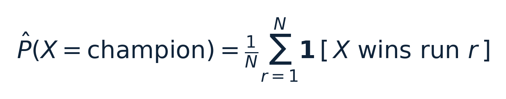
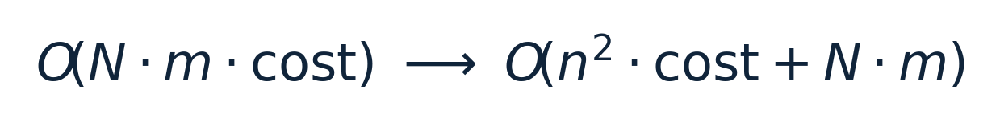
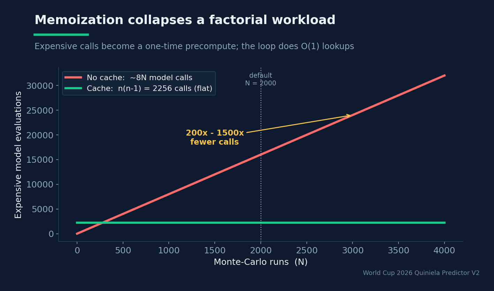
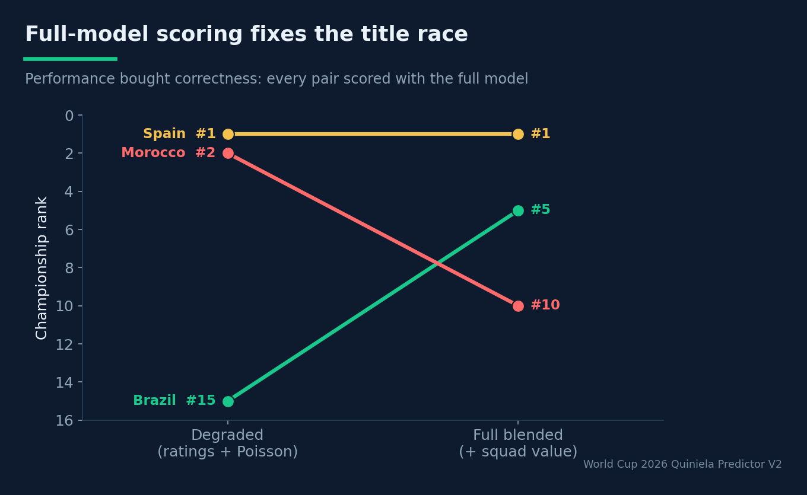

# 200×–1500×: Caching and Vectorizing a Monte-Carlo Tournament Simulator

## How a memoization table and a NumPy rewrite turned an intractable simulation into a coffee-break job

**Estimated reading time:** ~12 minutes

**SEO keywords:** Monte Carlo simulation, performance optimization, memoization, NumPy vectorization, computational complexity, sports simulation, prediction caching, lexsort

**Medium tags:** Python, Performance, Monte Carlo, Data Science, Software Engineering

---


### Introduction

There is no closed-form expression for the probability that a given team wins the World Cup.
The bracket is *endogenous*: who you play in the round of 32 depends on how the group stage
shook out, which depends on the results of matches that depend on the same probabilities you're
trying to propagate. When a quantity has no analytic form, you reach for the oldest trick in
computational physics — Monte-Carlo. Sample the whole stochastic process thousands of times,
count how often each event occurs, and let the law of large numbers do the rest.

The catch is cost. A faithful tournament simulation for 48 teams, run thousands of times, with a
moderately expensive probability model in the inner loop, is the kind of workload that quietly
turns into an overnight job. This article is about the two optimizations that kept it a
coffee-break job instead: a prediction **cache** that collapses a factorial number of model
calls into a one-time precompute, and a **NumPy-vectorized** group-stage engine. Together they
produced an observed speedup of **200× to 1500×** — and, just as importantly, made it feasible to
score every matchup with the *full* model instead of a degraded one.

### Background Theory

#### Monte-Carlo and the O(N^(-1/2)) wall

The estimator is the obvious one:



Its standard error scales as O(N^(-1/2)). That's the fundamental tax of Monte-Carlo: to halve
your error you must *quadruple* your samples. The default is N = 2000 runs, which gives
serviceable resolution on championship probabilities (a few tenths of a percent of noise). But
O(N^(-1/2)) also means you cannot buy precision cheaply by cranking N — so every constant
factor in the per-simulation cost matters enormously. Cutting the cost of one simulation by 1000×
is worth as much as a million-fold increase in N would have cost you.

#### Where the cost actually lives

Each simulation does a lot: simulate 72 group-stage matches (12 groups × 6), rank each group
with FIFA tiebreakers, select the 8 best third-place teams, build the round-of-32 bracket, and
propagate winners through five knockout rounds. The expensive part is **calling the probability
model** — `predict_fn(a, b)` — for every match. Naively, that's roughly 8N to dozens-of-N
model evaluations, each potentially running a blended ensemble (ratings + Poisson + possibly
XGBoost/multinomial). The model call, not the bookkeeping, is the hot path.

### System Design / Methodology

#### Optimization 1: the prediction cache (factorial → quadratic)

Here is the key observation: there are only n = 48 teams, so there are only n(n-1) = 2256
distinct *ordered* matchups. Across thousands of simulations, the model is being asked the
*exact same question* — "what's P(outcome) for team a vs team b on neutral ground?" — over and
over. That's textbook memoization.

Before the main loop, the simulator precomputes the entire matchup matrix once:

```python
teams = sorted(unique(team_a ∪ team_b))
cache = {}
for a in teams:
    for b in teams:
        if a != b:
            cache[(a, b)] = predict_fn(a, b)
predict = lambda a, b: cache[(str(a), str(b))]
```

The complexity transformation is the whole story:




*Without the cache, expensive model calls grow linearly with the number of runs N. With it, they collapse to a fixed one-time precompute of n(n-1) = 2256 calls; the inner loop does O(1) lookups.*

where m is matches per simulation. The expensive model evaluation now happens n^2 = 2256
times *total*, regardless of N; inside the loop, each "prediction" is an O(1) dictionary
lookup. The more expensive the model, the bigger the win — hence the observed **200×–1500×**
range, depending on how heavy `predict_fn` is. The project enforces this with a hard rule:
*never call `predict_fn(a, b)` inside the simulator's hot loop* — always go through the cache.

The cache is built in the simulator's `__init__` and is itself non-trivial (≈45 seconds for 48
teams), which yields a secondary engineering rule: **reuse the simulator object** across multiple
`n_runs` settings rather than reconstructing it. The warmup is amortized over every run you do
afterward. (For fast logic iteration there's a `--no-cache` escape hatch with tiny `--n-runs`.)

There's a deeper reason the cache is *correct* and not just fast: `predict_fn` over a fixed
matchup is a **pure function**. On neutral ground, "team a vs team b" always has the same answer
within a single simulator instance — there is no per-match state to invalidate the memo. Purity
is the precondition that makes memoization safe; if home advantage or in-tournament form were
folded into the per-match call, the cache key would have to widen and the whole economics would
change. The system sidesteps that by scoring all pairs as neutral synthetic fixtures up front
(more on this below), which keeps the key as small as (a, b) and the cache as small as the
2256-entry table.

#### Optimization 2: vectorizing the group stage

The second hot spot is ranking groups. Done team-by-team in Python, computing standings and
applying tiebreakers across 12 groups every simulation is death by a thousand interpreter calls.
The `VectorizedGroupStageEngine` rewrites it in NumPy.

The elegant core is the tiebreaker. FIFA ranks a group by points, then goal difference, then
goals for. NumPy's `np.lexsort` sorts by the *last* key first and breaks ties with earlier keys,
so the keys are supplied in *increasing* order of importance and the result reversed:

```python
keys = (random_noise, goals_for, goal_diff, points)
order = np.lexsort(keys)[::-1]   # descending
```

The trailing `random_noise` key is a small, clean touch: it resolves any remaining exact ties
uniformly at random rather than by array position, removing a subtle ordering bias. This ordering
is load-bearing — the project warns that changing the key order *breaks the FIFA tiebreaks* — but
expressed as a single vectorized sort it's both fast and auditable. The same trick selects the 8
best third-place teams: rank all 12 third-placed teams globally with the same keys, take the top
8.

#### The payoff that performance unlocked: scoring with the full model

This is the part that elevates the optimization from "nice" to "the reason the results are
trustworthy." Before, the Monte-Carlo simulator ran with a *degraded* model. Because it called
`predict_single(a, b)` with only team names, the multinomial and XGBoost models were skipped (no
feature columns), so the simulation effectively saw only ratings + Poisson. The champion
distribution reflected results-history, not talent.

With caching making model calls cheap, the simulator could afford to do it right.
`feature_builder.build_pairwise_feature_matrix(teams)` constructs *synthetic neutral fixtures*
for all n(n-1) pairs and runs them through the **same** feature pipeline as real matches —
squad-value as-of joins, strength differentials, neutral context — then scores them once with
the **full blended model**. The simulator just looks the results up. The effect was concrete and
documented: Brazil moved from #15 to #5, Morocco from #2 to #10, Spain to ~12% at #1. The
distribution finally reflected *talent*, not only past results — and it was the performance work
that made paying for the full model affordable. The rule that followed: if you touch the
simulator, keep this pre-scoring, or it silently reverts to the degraded model.


*Once caching made model calls cheap, the simulator could score every pair with the full talent-aware model. The title race shifted accordingly — performance bought correctness.*

### Experiments and Results

The quantitative outcomes the project records:

- **200×–1500× speedup** from the prediction cache, the range depending on `predict_fn` cost.
- **≈45 s** one-time cache warmup for 48 teams, amortized across all subsequent runs of the
  reused simulator.
- **N = 2000** default runs, with O(N^(-1/2)) error — enough resolution for championship and
  round-reached probabilities that sum to ≈ 1.0 (a validated invariant).
- A qualitatively *better* champion distribution, as a direct consequence of being able to run
  the full model in the loop.

It's worth being explicit about the accounting behind the headline number. Without the cache, a
run of N = 2000 simulations performs on the order of 8N model evaluations — roughly 16,000
calls to a blended ensemble that may run a logistic regression, an XGBoost forest, a Poisson/
Skellam computation, and a weighted blend on each call. With the cache, that count drops to the
fixed n(n-1) = 2256 evaluations regardless of N, plus N · m trivial dictionary lookups.
The ratio of "expensive calls saved" already explains a large constant factor; the rest of the
200×–1500× spread comes from how heavy the configured `predict_fn` is. Run a cheap ratings-only
model and the win is at the low end; run the full talent-aware blend and the win balloons, because
each avoided call was that much more expensive. The cache, in other words, is *most* valuable
exactly when the model is *most* expensive — which is precisely the regime you want to be in for
accuracy.

There is also a cautionary performance-adjacent bug worth citing, because it shows that speed is
worthless without correctness. The knockout round-recorder once used `setdefault` to log how far
each team advanced. But teams *advance*, and the label must be overwritten each round — with
`setdefault`, the first write wins, so every team was frozen at "round of 32" forever and the
`round_reached_probabilities.csv` had a single stage in it. The fix is a plain assignment
(`rounds_reached[t] = label`). A fast simulator that records the wrong thing is just wrong,
faster.

> **Performance bought correctness.** A cheap-enough model call is what let the simulator afford to score every matchup with the full, talent-aware model — and a fast simulator that records the wrong thing is just wrong, faster.

### Lessons Learned

- **Find the repeated question.** The cache works because thousands of simulations ask the same
  n(n-1) questions. Memoization is the highest-leverage optimization when the input space is
  small and the function is pure.
- **Constant factors dominate under O(N^(-1/2)).** When error only falls as √N, you
  can't sample your way out of a slow inner loop. Optimize the constant.
- **Vectorize the bookkeeping, not just the math.** `np.lexsort` made the FIFA tiebreaker both
  faster and more readable than a Python ranking loop.
- **Performance buys correctness.** The cache didn't just speed things up — it made it affordable
  to run the *full* model in the loop, which is what made the champion distribution trustworthy.
- **Amortize warmups by reusing state.** A 45 s cache build is cheap if you reuse the simulator
  and expensive if you rebuild it per run.
- **Fast and wrong is still wrong.** The `setdefault` knockout bug is the reminder that
  optimization is meaningless without correctness invariants.

### Future Work

Two natural extensions. First, **parallelism**: simulations are embarrassingly parallel across
runs, and with a read-only shared cache they could be farmed across cores or machines for
near-linear scaling — useful if higher-resolution tail probabilities (deep-run odds for specific
teams) are ever needed. Second, **a richer knockout model**: penalty shootouts are currently a
Bernoulli proxy around relative strength, which the project flags as a simplification.
Per-nation historical penalty-conversion rates would add realism to the one part of the
simulation where the generative model is admittedly thin — though, true to the project's
discipline, only if the backtest says it helps.

### Conclusion

Monte-Carlo is the right tool when a probability has no closed form, but its O(N^(-1/2)) error
makes the per-sample cost the thing that decides whether the method is practical. Two classic
moves — memoizing a pure function over a small input space, and vectorizing the bookkeeping with
NumPy — collapsed a factorial workload into a coffee break and bought a 200×–1500× speedup. The
deeper lesson is that performance is not a vanity metric here: it was the enabling condition for
*correctness*, because only a cheap-enough model call let the simulator afford to score every
matchup with the full, talent-aware model. Fast code, in the end, is what made the answer worth
trusting.
