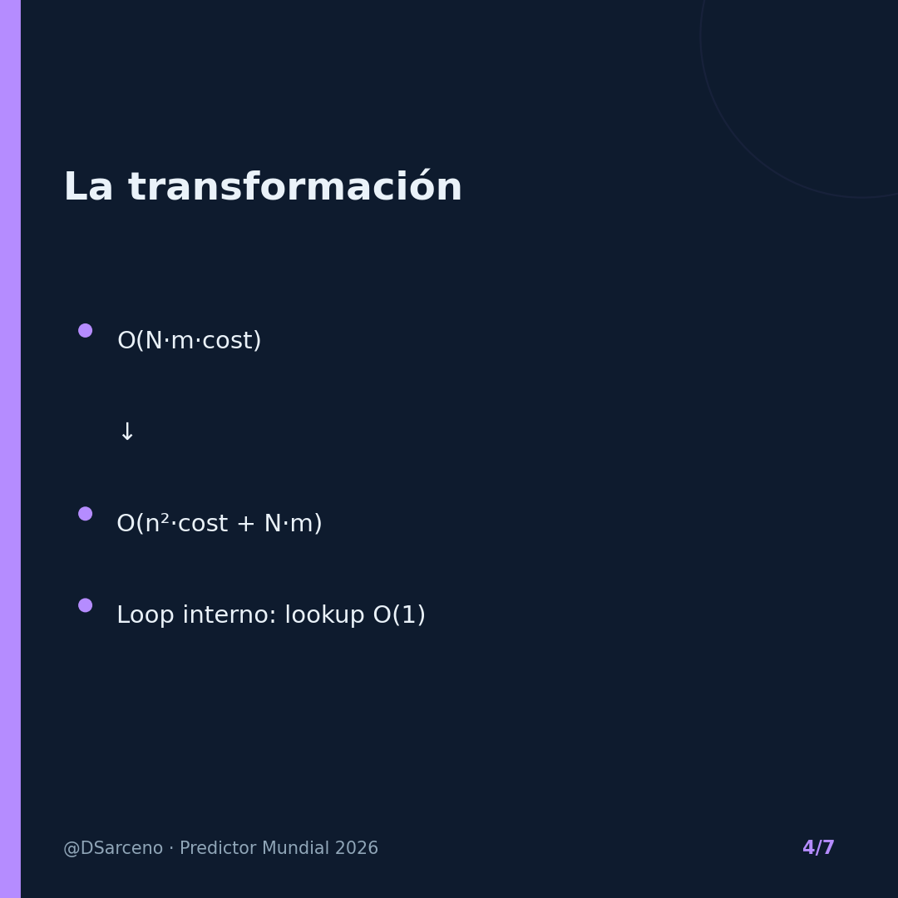

# LinkedIn Carousel 4 — 200x-1500x: Caching a Monte-Carlo Simulator

**Formato:** 7 slides cuadradas (1080×1080), listas para subir como carrusel/documento en LinkedIn.
**Acompaña a:** [04_linkedin_post.md](04_linkedin_post.md) · Artículo: [04_caching_a_monte_carlo_simulator.md](04_caching_a_monte_carlo_simulator.md)

**Cómo publicar:** sube las 7 imágenes en orden (o expórtalas a un PDF y publícalo como *documento*). Pega el texto de [04_linkedin_post.md](04_linkedin_post.md) como cuerpo del post.

---

### Slide 1/7

### Slide 2/7

### Slide 3/7

### Slide 4/7

### Slide 5/7

### Slide 6/7

### Slide 7/7

