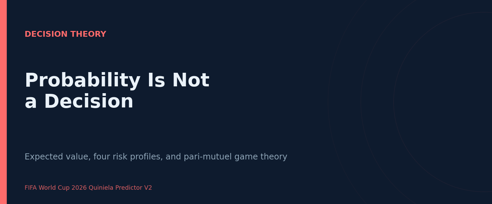
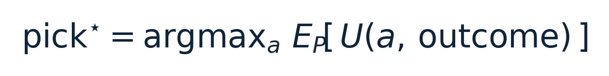
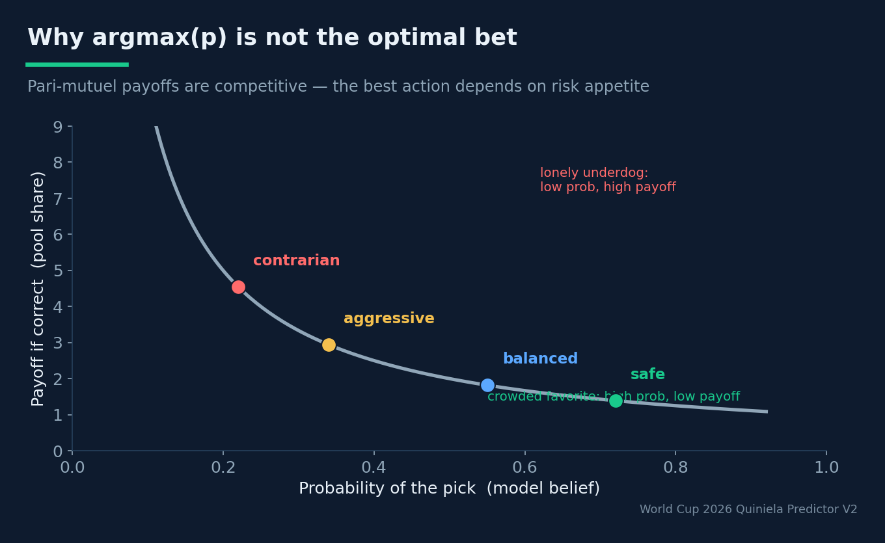
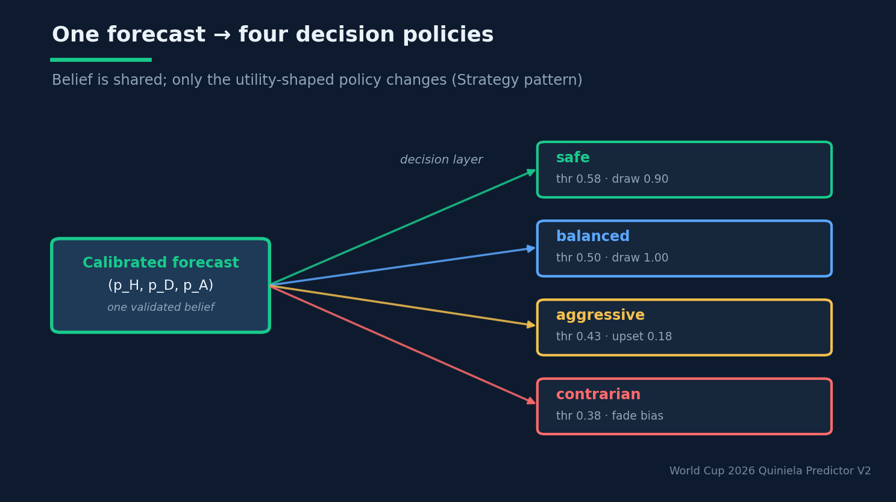

# Probability Is Not a Decision

## Why a World Cup predictor ships four different answers from one forecast — and what pari-mutuel game theory has to teach data scientists

**Estimated reading time:** ~11 minutes

**SEO keywords:** expected value, decision theory, probability calibration, pari-mutuel betting, sports betting strategy, utility function, game theory, prediction pools

**Medium tags:** Data Science, Decision Theory, Machine Learning, Game Theory, Sports Analytics

---

### Introduction

Ask most data scientists what a good forecasting system does and they'll say "output accurate,
well-calibrated probabilities." That's necessary, but it's only half a system. A probability is a
belief about the world; a *decision* is an action you take given that belief and what you stand to
gain or lose. The two are not the same object, and conflating them is one of the most common
quiet mistakes in applied ML.

The FIFA World Cup 2026 forecaster makes this distinction architectural. Its stated objective is
not academic accuracy — it is **maximizing expected value in quinielas** (prediction pools). And
because the optimal *bet* depends on the player's utility and on what everyone else is betting,
the system emits **four different pick sheets from one identical forecast**: `safe`, `balanced`,
`aggressive`, and `contrarian`. The probability layer and the pick-selection layer are
deliberately decoupled. This article argues that decoupling is the mature design, walks through
the decision logic of the four profiles, and connects it to the game theory of pari-mutuel
betting — a lesson that generalizes to any system where a model output feeds a high-stakes choice.

### Background Theory

#### Belief versus action

The cleanest way to see the separation is through expected utility. A calibrated model gives you
P(outcome). But the *decision* you should make is

where U is your utility function. If U is just "1 if correct, 0 otherwise," then the optimal
pick is `argmax(p)` and decision collapses back into probability. But that utility is almost
never the real one. In a prediction pool your payoff depends on **what other players picked**: a
correct call that everyone else also made wins you little; a correct call that few others made
wins you a lot. The utility is *competitive*, not absolute — and the moment U stops being
trivial, the optimal action diverges from `argmax(p)`.

This is why "just pick the most likely outcome" is wrong for a quiniela even with a perfect
model. The most likely outcome is also the one everyone else picks. You can be the most accurate
player in the pool and still lose, because accuracy isn't what's being rewarded — *differentiated*
accuracy is.

#### Pari-mutuel game theory

In pari-mutuel betting the pot is split among the winners, so your expected return on a given
pick is inversely related to how many others share it. This sets up a genuine game-theoretic
tension: the favorite has the highest probability but the lowest payoff-if-correct because it's
crowded; an underdog has lower probability but a much higher payoff-if-correct because it's
lonely. The optimal strategy is not "always favorites" or "always upsets" — it's a function of
your risk appetite and your model of the crowd. A leader protecting a lead wants low variance
(favorites); someone who needs a comeback wants high variance (contrarian upsets). One forecast,
many optimal actions.

*Because the pot is split, a crowded favorite pays little if correct while a lonely underdog pays a lot. The optimal pick is not argmax(p) — it depends on risk appetite.*

> **You can be the most accurate player in the pool and still lose** — because accuracy isn't what's rewarded; differentiated accuracy is.

### System Design / Methodology

#### One forecast, four decision policies

The architecture mirrors the theory exactly. A single calibrated probability vector
(p_H, p_D, p_A) — produced by the ensemble of ratings, multinomial, XGBoost and Poisson, then
calibrated — feeds a `PickOptimizer` that applies four different decision policies. The policies
are parameterized by three knobs: `favorite_threshold` (how confident must the favorite be to
back it), `upset_tolerance` (how much underdog probability is enough to gamble), and `draw_bias`
(how willing to call a draw):

| Profile     | favorite_threshold | upset_tolerance | draw_bias | Policy |
|-------------|--------------------|-----------------|-----------|--------|
| safe        | 0.58               | 0.05            | 0.90      | Strict argmax, favors clear favorites |
| balanced    | 0.50               | 0.10            | 1.00      | Falls back to a draw if no favorite clears 0.50 |
| aggressive  | 0.43               | 0.18            | 1.10      | Takes upsets when fragility/volatility fire |
| contrarian  | 0.38               | 0.25            | 1.15      | Fades reputation; chases differentiation |

*One validated belief, four utility-shaped policies. Only the decision layer changes between risk profiles — the probability is shared (the Strategy pattern in practice).*

The non-trivial logic lives in `aggressive` and `contrarian`. The **aggressive** profile only
takes an upset when *three* conditions co-fire: an `upset_window_score ≥ 0.5`, a
`favorite_fragility_score ≥ 0.5`, and the underdog's probability clears the `upset_tolerance`.
That's a disciplined gamble — it bets against the favorite only when the engineered signals say
the favorite is genuinely fragile, not on a whim. The **contrarian** profile explicitly *fades
the team with the higher public-bias proxy*, deliberately trading away some accuracy to maximize
differentiation from the crowd — pure pari-mutuel reasoning encoded in a rule.

Crucially, these are **strategy objects**, not separate models. The same calibrated forecast
drives all four; only the utility-shaped decision policy changes. This is the Strategy design
pattern doing exactly what it's for, and it means the entire modelling investment is shared
across every risk profile.

#### Why the decoupling is the right call

Three engineering payoffs flow from separating belief from action:

1. **Single source of probabilistic truth.** There is one forecast to validate, calibrate, and
   backtest. The risk profiles can't disagree about *what's likely* — only about *what to do*.
2. **Cheap experimentation on the decision layer.** Adding a fifth profile is editing a
   strategy table and a branch of logic — no retraining, no revalidation of probabilities. The
   project documents this as a five-step, model-free change.
3. **Honest calibration.** Because the probabilities aren't bent to serve a particular betting
   style, they stay calibrated, and the calibration metrics (ECE, reliability diagram) mean what
   they say. A system that fused belief and action would have to recalibrate per strategy and
   couldn't trust any single reliability diagram.

There is a small but telling detail in how the profiles handle the *draw* — the outcome that
quietly decides most pools because it's the hardest to call and the easiest to under-predict. The
`draw_bias` knob scales each profile's willingness to commit to a tie, from 0.90 (safe, draw-shy)
up to 1.15 (contrarian, draw-hungry), and the balanced profile carries an explicit fallback: if
no favorite clears a 0.50 threshold, it calls the draw rather than forcing a coin-flip between two
near-equal sides. This is a clean example of the decision layer encoding domain knowledge that has
no place in the probability layer. The Skellam-based model already calibrates draws better than a
score grid would; the `draw_bias` is not a correction to that probability, it is a *preference*
about when to act on it. Belief and preference, kept apart.

### Experiments and Results

The decoupling is validated structurally rather than by a single accuracy number — and that's the
point. The probability layer is held to proper scoring rules in the leakage-free backtest
(log-loss ≈ 0.99 vs uniform ln 3 ≈ 1.0986, with squad value improving it to 0.9905). The
decision layer is held to a *different*, custom metric that reflects the actual game: the quiniela
score awards **1 point for a correct 1X2, +2 for an exact scoreline, +1 for correctly calling an
upset.** Notice how that scoring rule rewards exactly the behaviors the aggressive and contrarian
profiles are built to produce — calling upsets and nailing exact scores — which would *lower* a
plain-accuracy number. Measuring the two layers with two different yardsticks is not sloppiness;
it's the recognition that they optimize for two different things.

The invariants the system checks reinforce the separation. Each quiniela sheet must have exactly
one row per fixture with a value in `{H, D, A}` — a well-formed *decision*. The probability
vectors must sum to 1.0 within tolerance — a well-formed *belief*. Two layers, two contracts.

There's a subtler result here too. The project's own notes observe that the championship
probability list "is misleading" — a results-based model ranks an over-performing team first on
merit. A naive system would try to *fix the probabilities* to look right. The decoupled design
resists that temptation: the probabilities stay honest (validated by backtest), and any
"correction" for how you want to bet lives in the decision layer where it belongs, as an explicit,
inspectable policy — not as a thumb on the scale of the model.

### Lessons Learned

- **A probability is not a decision.** The optimal action depends on a utility function the
  model doesn't know. Bake the separation into the architecture.
- **`argmax(p)` is optimal only under 0/1 utility.** The moment payoffs are competitive (as in
  any pool, market, or auction), the best action diverges from the most likely outcome.
- **Differentiated accuracy beats raw accuracy in competitive settings.** You can be the most
  accurate player and still lose a pari-mutuel game.
- **Decoupling keeps your calibration honest.** One validated forecast; many policies. You never
  bend the probabilities to serve a strategy.
- **Measure each layer with its own metric.** Proper scoring rules for the belief layer, a
  game-specific utility score for the decision layer. Using accuracy for both would mis-judge
  both.
- **The Strategy pattern is decision theory in code.** Four profiles are four utility functions,
  not four models.

### Future Work

The decision layer has room to become genuinely game-theoretic. Today the contrarian profile
fades a *proxy* for public bias; with real data on what a specific pool is picking, it could
solve closer to a true best-response — explicitly modeling opponent picks and the pot-splitting
dynamics rather than approximating them with a reputation penalty. On the belief side, the most
cited missing ingredient is a **bookmaker-consensus prior**: the market's de-overrounded odds are
the closest thing to ground-truth probabilities in this domain, and feeding them into the forecast
would tighten the belief layer that every decision policy depends on. Both improvements respect
the architecture — one sharpens beliefs, the other sharpens actions, and the seam between them
stays clean.

It is worth naming the failure mode the decoupling avoids, because it is so common it usually goes
unnoticed. When belief and action are fused, every shift in betting appetite tempts you to retrain
or re-weight the *model* — a more aggressive bettor "needs a more aggressive model" — and within a
few iterations you have several models that disagree about what is likely, none of them cleanly
calibrated, and no single reliability diagram you can trust. The probabilities have absorbed the
strategy, and you can no longer tell a genuine forecasting improvement from a change in risk
appetite. The decoupled design makes that confusion structurally impossible: there is exactly one
forecast, scored by proper rules in the backtest, and the strategy lives downstream as inspectable
policy. When the project's own notes warn that the championship list "is misleading," the
discipline holds — the fix is never to bend the probabilities toward a prettier table, but to read
the honest probabilities and let the decision layer express whatever preference you actually have.

### Conclusion

The most quietly sophisticated decision in this World Cup forecaster isn't a model — it's a
refusal to confuse two things most systems blur together. A probability is a calibrated belief
about the world; a pick is a utility-maximizing action given that belief and a competitive
payoff structure. By holding them in separate layers — one validated forecast feeding four
risk-tiered decision policies — the system keeps its probabilities honest, makes its betting
strategies cheap to experiment with, and encodes the game theory of pari-mutuel pools directly
into inspectable rules. For data scientists, the transferable lesson is bigger than football:
whenever your model output feeds a real decision, ask what utility function actually governs the
choice — because it's almost never the 0/1 loss your `argmax` quietly assumes.
