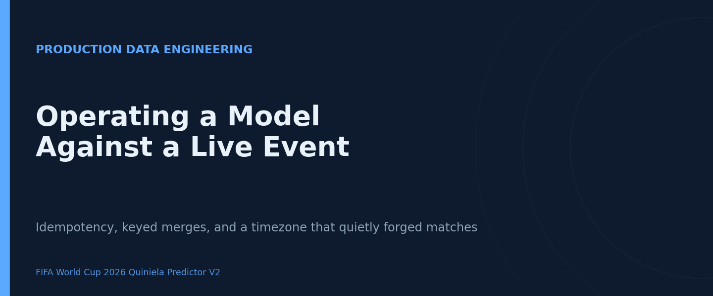
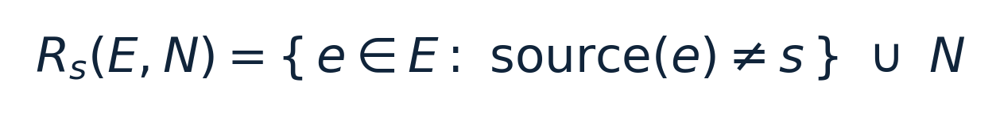
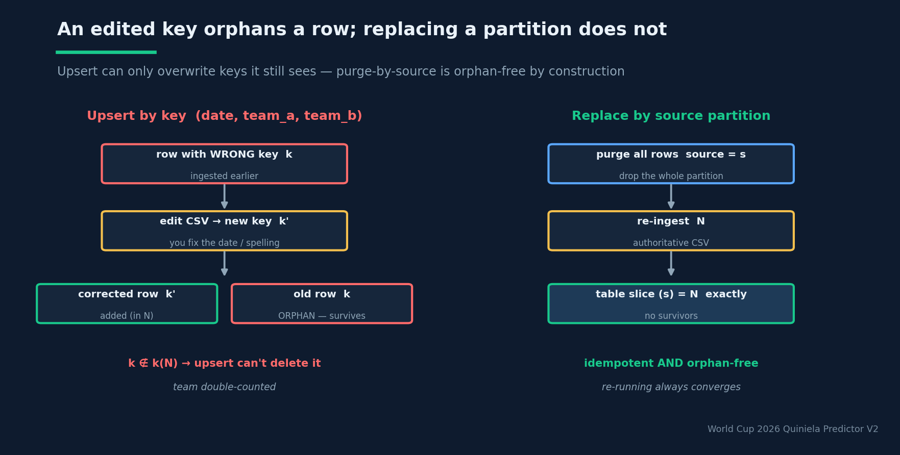

# Operating a Model Against a Live Event

## The unglamorous data-integrity mathematics that decides whether a live forecaster tells the truth — idempotency, keyed merges, and a timezone that quietly forged matches

**Estimated reading time:** ~13 minutes

**SEO keywords:** data integrity, idempotency, upsert semantics, keyed join, referential integrity, timezone bug, ETL pipeline, reproducible machine learning, schema validation, defense in depth

**Medium tags:** Data Engineering, MLOps, Software Engineering, Data Science, Sports Analytics

---



### Introduction

A forecasting model can be perfectly specified, well-calibrated, and validated by a leakage-free
backtest — and still emit nonsense in production, because the data feeding it has quietly drifted
out of sync with reality. During a live tournament this is not a tail risk; it is the *default*
risk. The pipeline no longer runs once on a frozen dataset. It runs every matchday, against a
table that you are editing by hand under time pressure, and **correctness now depends on the
algebra of how new results are merged into the old ones.**

This article is a field report from running the FIFA World Cup 2026 forecaster live, told through
three real failures: a timezone offset that fabricated matches that never existed, "orphan" rows
that double-counted teams after an innocent correction, and a single mistyped comma that crashed
the whole update with a `TypeError`. None of these are modelling bugs. All of them are
*data-integrity* bugs, and each one turns out to have a precise formal cause — and a precise fix.
The transferable lesson is that the reliability of a live ML system is governed less by its loss
function than by whether its data operations are **idempotent**, **key-stable**, and
**schema-validated**.

### Background Theory

#### The canonical table as a relation

The system keeps a single source of truth: a canonical match table `matches_unified.csv`. Treat it
as a relation — a set of rows — where each match is identified by a key
`k(row) = (date, team_a, team_b)`. Every output (ratings, features, probabilities, the Monte-Carlo
simulation) is rebuilt *from this relation* on each run. So the only way a re-run changes an output
is by changing the relation. That makes the **merge operator** — how new results are folded into the
table — the single most safety-critical piece of plumbing in the system.

#### Upsert semantics, and why "re-running" doesn't always fix things

The original merge was a deduplicated concatenation: append the new rows, then
`drop_duplicates(subset=[date, team_a, team_b], keep="last")`. Formally, given the existing set `E`
and the incoming set `N`, this is an **upsert keyed by k** — drop every existing row whose key also
appears in `N`, then take all of `N`:


This has a comforting property — it is **idempotent in N**: re-ingesting the same results twice
changes nothing, `U(U(E, N), N) = U(E, N)`. That is exactly the behaviour you want, and it is why
"just run it again" *feels* like it should always work.

> An upsert keyed by k can only ever **overwrite or add** rows whose key is in the new batch. It is
> structurally incapable of deleting a row whose key you changed.

That single limitation is the seed of the orphan bug below.

#### Idempotency, formally

A function `f` is **idempotent** iff `f(f(x)) = f(x)`. For a pipeline that re-runs against mutating
data, idempotency is not a nice-to-have; it is the property that lets you re-run freely without
accumulating artefacts. The upsert is idempotent *with respect to re-applying the same N*. It is
**not** idempotent across a *correction* to a key — and the difference is where the system bled.

#### Time as lossy arithmetic

The upstream feed (football-data.org) stores kickoff as a UTC timestamp; the canonical date is the
truncation `date = utcDate[0:10]` — the calendar day, in UTC. Truncation is a lossy projection. A
World Cup 2026 match kicking off in the evening on the North American west coast — say 2026-06-20,
20:00 local (UTC−7) — is **2026-06-21, 03:00 UTC**, which truncates to `2026-06-21`. If a human
enters the result using the *local* matchday (06-20), the key they produce,
`k = (2026-06-20, team_a, team_b)`, does not equal the key of the scheduled fixture,
`k = (2026-06-21, team_a, team_b)`, so the upsert cannot match them. The result lands on a brand-new
row (a **phantom match** that was never on the calendar) while the real fixture stays unplayed
forever. Key collision requires *identical truncated UTC dates*; a local-date entry silently breaks
the join.

### System Design / Methodology

#### Failure 1 — the CSV that lied (orphans as a referential-integrity violation)

The orphan bug is the upsert limitation made flesh. Suppose a result was ingested with a wrong key
(wrong date, or a misspelled team), and you later **correct the CSV**. The corrected row carries a
*new* key `k′`. On the next ingest the corrected row `k′` is added (it's in `N`), but the old, wrong
row `k` is **not** in `k(N)` anymore, so the upsert leaves it untouched. You now have two rows for
one real match — the corrected one and an **orphan** — and the team's goals are counted twice in
standings and ratings. Re-running does not help, precisely because the upsert is incapable of
deleting a row whose key is no longer in the batch. In relational terms, editing a primary key
without a cascading delete is a referential-integrity violation.

The fix is to replace the upsert with a stronger, genuinely orphan-free operation. Partition the
table by a `source` tag and **purge-then-reingest** that whole partition, where `N` carries
`source = s` (here, `tournament_update`):



This makes the manual CSV the *authoritative record* of its own partition. `R_s` is idempotent
**and** surjective onto the partition: after it runs, the set of rows with `source = s` equals `N`
exactly — no survivors, no orphans, regardless of how many keys you edited. The proof is immediate:
`R_s` removes every existing row with source `s`, then unions in `N` (all tagged `s`), so the
source-`s` slice of the output is exactly `N`. This is the `replace_source=True` mode now wired
through `append_results` and the matchday script (it is the default; `--append-only` falls back to
the old upsert for partial CSVs).


*Editing the dedup key (a fixed date or spelling) makes the old row invisible to a keyed upsert, so it survives as an orphan. Purging the whole `source` partition before re-ingesting is idempotent and orphan-free by construction.*

#### Failure 2 — the timezone that forged matches

The phantom-match bug needs no code change to *avoid* — it needs the human to enter the **UTC**
date. To make that the path of least resistance, the system ships a `fixture_date.bat` helper that
looks up a fixture's canonical (UTC) date by team name, so the operator copies the right key instead
of guessing from the local broadcast time. The cleanup for already-poisoned data was a one-time
purge of the phantom rows plus a re-ingest under `replace_source` — the same orphan-free operation
doing double duty.

#### Failure 3 — the comma that became a `TypeError`

CSV is a **positional** format: meaning is carried by column order, not by name. A stray delimiter —
a comma typed as a period, e.g. `WC.GROUP_STAGE` instead of `WC,GROUP_STAGE` — shifts every
subsequent field one position to the left. A string then lands in a numeric column (`score_a`), and
a downstream comparison detonates:

```text
TypeError: '>' not supported between instances of 'float' and 'str'
```

Formally, the row violated the schema's **arity** (number of fields) and **domain** (column types).
The defense is twofold, applied at different layers:

- **At compute:** coerce and skip. `world_cup_state` now does `pd.to_numeric(x, errors="coerce")`
  and skips rows whose score is non-numeric, logging a warning instead of crashing.
- **At ingestion (recommended gate):** validate arity and domains before a row is allowed into the
  canonical table at all.

This is **defense in depth**: a single validation layer is a single point of failure; the same
invariant enforced at ingestion *and* at compute degrades gracefully instead of crashing.

#### Failure 4 — the estimator whose question changed underneath it

The subtlest live-only failure is not a corrupted row at all. The Monte-Carlo championship
simulator selects only the group fixtures that are **still unplayed** and builds the entire bracket
from that set. Pre-tournament, that set is all 72 group matches and the simulation is correct.
*Mid-tournament*, once whole groups finish, the unplayed set shrinks — and the simulator silently
runs a sub-tournament of only the groups that still have games, so the championship list collapses
to those teams. Nothing is corrupted; the **support set of the estimator changed** as results
arrived, and the code never noticed. It is the cleanest possible reminder that a computation can be
correct on day 1 and meaningless on day 12 without a single line changing.

### Experiments and Results

The fixes were developed test-first. Two unit tests pin the merge semantics so they cannot regress:
`test_replace_source_removes_orphans` injects an orphan (an edited key) and asserts the canonical
table mirrors the CSV exactly after a replace-mode ingest; `test_append_mode_keeps_orphans` asserts
the opposite for the explicit `--append-only` path. They sit inside the project's broader unit suite
(44 tests passing), so the invariant "replace mode is orphan-free, append mode is not" is now an
executable contract rather than a hope.

The empirical signature of each bug was distinctive and, in hindsight, diagnostic:

- **Phantom matches:** a *systematic* one-day offset — every evening kickoff appeared twice, once as
  a played phantom on the local date and once as an unplayed fixture on the UTC date. A random
  scatter of duplicates would have implied typos; a uniform −1-day shift implied a timezone law.
- **Orphans:** a team's points or goal difference inflating immediately after a *correction*, never
  after a fresh ingest — the tell that the dedup key, not the data, was the problem.
- **The `TypeError`:** a hard crash that pointed (via the stack trace) straight at a numeric
  comparison, which back-traced to a single malformed row — a reminder to *read the whole stack
  trace* before theorising.

> The bugs that survive into production are rarely in the mathematics. They are in the seams — the
> joins, the truncations, the column boundaries — where one component hands data to the next.

### Lessons Learned

- **Idempotency is a property you design for, not one you assume.** If re-running your pipeline can
  change the answer, your merge is not idempotent and you will eventually be surprised.
- **A primary key you can edit is a primary key that creates orphans.** Either forbid key edits or
  replace upsert-by-key with purge-by-source. The latter is idempotent *and* orphan-free.
- **Time zones are arithmetic, and truncation is lossy.** Decide on one canonical timezone (UTC
  here), make the correct key the easy key (a lookup helper), and never let a human guess it from a
  broadcast clock.
- **Positional formats need a schema contract.** Validate arity and column domains at ingestion;
  coerce-and-skip at compute. Defense in depth turns a crash into a logged warning.
- **Correct today ≠ correct tomorrow.** An estimator whose support set depends on live data (the
  simulator) can quietly answer a different question. Audit the *inputs’ shape*, not just the code.

### Future Work

The natural next step is a hard **validation gate** at ingestion — reject any row that fails arity
or domain checks before it can reach the canonical table — so the coerce-and-skip at compute becomes
a second line of defense rather than the first. A close second is **dated output snapshots**: because
outputs are regenerated from the (mutating) canonical table and are not version-controlled,
capturing a timestamped copy of each matchday's predictions would make the system's past beliefs
auditable, and would unlock honest before/after comparisons once the tournament ends. Finally, the
simulator should be reworked to **seed current standings from played results** and simulate only the
remaining matches plus the bracket, so its championship estimate stays meaningful through the entire
event rather than only before kickoff.

### Conclusion

The interesting engineering in a live forecaster is not where you'd expect. The model was the easy
part; it was specified once and validated by a backtest. The hard part was keeping the data honest
while editing it by hand, every day, under pressure — and that turned out to be a problem in
*algebra*, not statistics. An upsert keyed by a mutable field cannot delete what it can no longer
see; a truncated timestamp cannot be un-truncated; a positional format cannot defend its own column
boundaries. Name those properties — idempotency, key stability, schema validity — and the fixes
write themselves: purge-by-source instead of upsert-by-key, one canonical timezone with a lookup
helper, validation at the seams. The payoff is a system that is *boring* to operate during the one
month it most needs to be, which is the highest praise a production pipeline can earn.
