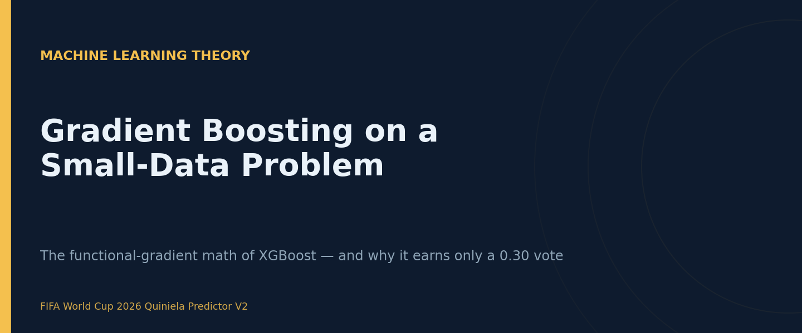
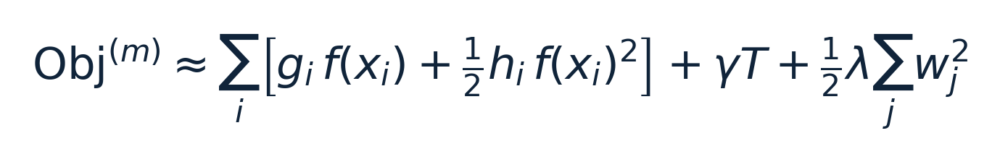
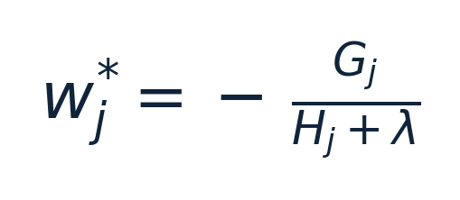
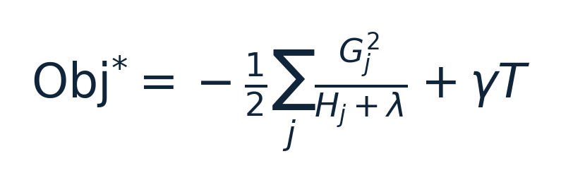
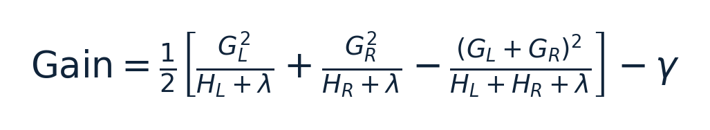
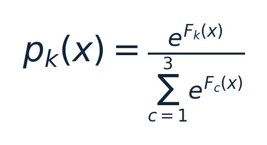
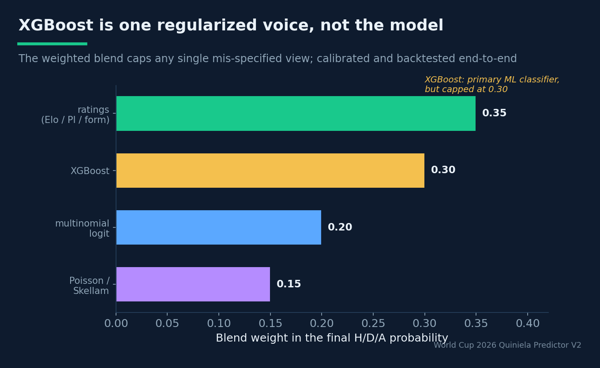

# Gradient Boosting on a Small-Data Problem

## The functional-gradient mathematics of XGBoost — and why a regularized tree ensemble earns a 0.30 vote, no more, in a 48-team World Cup forecaster

**Estimated reading time:** ~14 minutes

**SEO keywords:** gradient boosting, XGBoost, functional gradient descent, second-order Taylor expansion, regularization, gradient boosted decision trees, tabular machine learning, multiclass log-loss, bias-variance tradeoff, ensemble learning

**Medium tags:** Machine Learning, Data Science, Statistics, Mathematics, Sports Analytics

---

### Introduction

International football is a small-data problem wearing a big-data costume. A national team plays
only 8–15 official matches a year, its roster turns over between call-ups, and the usable history
for a 2026 World Cup model is on the order of 10⁴ matches total — *tens*, not thousands, per
relevant team. That regime rules out deep learning and points straight at the empirical
state-of-the-art for tabular data: **gradient boosted decision trees**, and specifically XGBoost.

But there is a twist that makes this a more honest case study than the usual "XGBoost wins Kaggle"
story. In this forecaster, XGBoost is *not* the model. It is **one of four voices** — blended with a
competition-aware Elo rating, a multinomial logistic regression, and a Poisson/Skellam goal model —
and it is given a blend weight of exactly **0.30**. This article develops the full mathematics of
why gradient boosting works (forward stagewise additive modelling, functional gradient descent, and
XGBoost's distinctive *second-order* regularized objective), then argues the harder point: on a
small structural problem, the mature use of a powerful learner is to **regularize it hard and
out-vote it**, not to crown it.

### Background Theory

#### Forward stagewise additive modelling

A boosted model is an additive expansion in a base-learner class (here, regression trees):

`F_M(x) = Σ_{m=1}^{M} ν · f_m(x)`,  with each `f_m` a regression tree and `ν ∈ (0, 1]` a learning rate.

We do not fit all `M` trees jointly — that is intractable. Instead we build them **greedily, one at
a time** (forward stagewise additive modelling). Having built `F_{m−1}`, we add one more term,
`F_m(x) = F_{m−1}(x) + ν · f_m(x)`, and choose `f_m` to most reduce the training loss
`L = Σ_i l(y_i, F(x_i))`. The scalar `ν` (shrinkage) deliberately under-commits to each new tree, so
that no single learner dominates.

#### Gradient boosting as gradient descent in function space

Friedman's insight (2001) is that this is **gradient descent — but in function space rather than
parameter space.** At step `m`, the direction of steepest loss reduction at each training point is
the negative gradient of the loss with respect to the current prediction,
`g_i = ∂ l(y_i, F(x_i)) / ∂F(x_i)`, evaluated at `F = F_{m−1}`. These `g_i` are the
**pseudo-residuals**: we fit the new tree `f_m` to them, so each tree learns where — and in which
direction — the ensemble is currently wrong. Adding `−ν ·` (that direction) is a step downhill.
Boosting is therefore an *optimisation algorithm*, and its convergence and regularization behaviour
can be reasoned about as such.

#### XGBoost's second-order, regularized objective

XGBoost sharpens this in two ways: it keeps the **second-order** term of the loss (a Newton step,
not just a gradient step), and it adds an **explicit regularizer** on tree complexity. Taylor-expand
the loss around the current prediction to second order and add the penalty `Ω`:

*`g_i` and `h_i` are the first and second derivatives (gradient and Hessian) of the loss at point i; the penalty `Ω(f) = γT + ½λΣ w_j²` charges γ per leaf and an L2 (and optional L1, α) penalty on the leaf weights `w_j`.*

The constant loss term `l(y_i, ŷ_i)` has been dropped (it does not depend on the new tree `f`). `T`
is the number of leaves and `w_j` the weight (output) of leaf `j`.

**For a fixed tree structure**, this objective is a sum of independent quadratics in the leaf
weights, so it has a closed-form minimiser. Let `I_j` be the points falling in leaf `j`, and define
`G_j = Σ_{i∈I_j} g_i` and `H_j = Σ_{i∈I_j} h_i`. Then the optimal leaf weight is

and substituting it back gives the "structure score" of the tree:

Notice what `λ` does: it **shrinks every leaf weight toward zero** and damps the score, directly
penalising confident fits. Regularization is not bolted on — it lives inside the optimal-weight
formula.

#### Splits, gain, and built-in pruning

Trees are grown by choosing the split that most improves the structure score. Splitting a node into
left/right children yields

A split is kept only if `Gain > 0`. Because the `γ` term is subtracted, **a split must buy enough
loss reduction to pay for the extra leaf** — this is regularization-by-pruning, expressed as a
threshold on a derivative-based score.

#### Multiclass: softprob over H / D / A

A football outcome is one of three classes — Home / Draw / Away — so the model uses
`objective = multi:softprob` with `K = 3`. The ensemble produces a score vector `F(x) ∈ ℝ³` (one
additive series per class), mapped to probabilities by the softmax

and trained against the **multiclass log-loss** `l(y, p) = − Σ_k 1[y = k] · log p_k`, summed over the
dataset:

*The proper scoring rule the model is trained on (eval_metric = mlogloss) and judged by in the backtest. Uniform guessing scores ln 3 ≈ 1.0986; the blended model lands near 0.99.*

#### Bias, variance, and why small data forces a heavy hand

Boosting reduces **bias** by adding learners until the training loss is small. The danger is
**variance**: with enough deep trees the ensemble memorises noise. The knobs that control variance
map one-to-one onto the theory above:

- **learning rate `ν`** — shrinkage; smaller `ν` (with more trees) generalises better;
- **`max_depth`** — the capacity of each *weak* learner; shallow trees = low variance;
- **`subsample`, `colsample_bytree`** — *stochastic* gradient boosting: each tree sees a random row
  and column subsample, decorrelating the ensemble and cutting variance;
- **`λ` (reg_lambda), `α` (reg_alpha), `γ`** — direct penalties in the objective.

In a regime with tens of examples per team, variance is the enemy. The correct posture is to keep
each learner deliberately weak and lean hard on every regularizer.

### System Design / Methodology

#### The actual configuration — read through the math

The project's XGBoost component (`config/model_params.yaml`) is tuned exactly as the theory
prescribes for small data:

| Hyperparameter | Value | What the math says it does |
|---|---|---|
| `objective` | `multi:softprob` | softmax over K=3, trained on multiclass log-loss |
| `max_depth` | 5 | shallow ⇒ low-variance weak learners |
| `learning_rate` (ν) | 0.05 | strong shrinkage; under-commit per tree |
| `n_estimators` (M) | 400 | many small steps compensate the small ν |
| `subsample` | 0.85 | stochastic boosting (row subsampling) |
| `colsample_bytree` | 0.85 | column subsampling ⇒ decorrelated trees |
| `reg_lambda` (λ) | 1.0 | L2 on leaf weights `w_j* = −G_j/(H_j+λ)` |
| `reg_alpha` (α) | 0.0 | L1 left off (L2 sufficed) |
| `tree_method` | `hist` | histogram split-finding for speed |

Small `ν` paired with `M = 400` is the classic "many slow steps" recipe: it traces a smoother path
down the loss surface than a few aggressive trees, and generalises better. `max_depth = 5` plus
85% row/column subsampling keeps each learner weak and decorrelated. `λ = 1` puts a standing L2 brake
on every leaf weight.

#### Why XGBoost is "primary" among models but only 0.30 of the system

In the config XGBoost is flagged `primary: true` — but that means *primary among the ML
classifiers*, not primary in the final probability. The ensemble is a **weighted blend** of ratings
(0.35), XGBoost (0.30), the multinomial logit (0.20) and Poisson/Skellam (0.15).

*XGBoost contributes 0.30 of the blended H/D/A probability, alongside ratings (0.35), the multinomial logit (0.20) and Poisson/Skellam (0.15). The blend is then calibrated and judged, end-to-end, by a leakage-free backtest.*

That 0.30 is a deliberate ceiling, and the reasoning is structural. XGBoost is a brilliant
*correlational* learner over engineered features (Elo, squad value, rolling form, host flag, travel
proxies), but it knows nothing about the **generative structure of goals** — that is the
Poisson/Skellam model's job — and it has no principled **rating prior** — that is Elo's. Left alone
on 10⁴ matches it would happily overfit confederation idiosyncrasies and small-sample flukes.
Blending caps the damage any single mis-specified view can do, and keeps the talent signal (squad
value, the most predictive covariate after Elo) flowing through a learner that can exploit its
non-linear interactions.

> A model's blend weight is a hyperparameter too. Deciding XGBoost is worth 0.30 — and no more — is
> as much a modelling decision as its tree depth, and it is made the same way: by the backtest.

#### Calibration after blending

Boosting minimises log-loss, but that does **not** guarantee its probabilities are calibrated once
they are blended with three other models on finite data. So the blended output is passed through a
calibration layer (isotonic regression and Platt/sigmoid scaling) and checked against an
out-of-sample reliability diagram. Belief is separated from confidence: the boosted scores are
*recalibrated*, not trusted as-is. Upstream, LASSO (L1) feature selection feeds the model a
parsimonious feature set, so the trees split on signal rather than on the long tail of weak,
collinear covariates.

### Experiments and Results

Every modelling choice here — including the 0.30 weight and the regularization settings — is
adjudicated by the same arbiter: a **leakage-free cross-tournament backtest** that trains on all
tournaments strictly before a held-out year `Y` and tests on year `Y`, scoring by held-out
multiclass log-loss. The blended model lands near **log-loss ≈ 0.99**, comfortably below the
uniform-guess baseline of `ln 3 ≈ 1.0986`, with the squad-value feature pushing it to ≈ 0.9905. The
discipline is that *face validity is never the metric* — a prettier champion list does not justify a
change; only a lower held-out log-loss does.

Two practical observations from operating this component:

- **Gain-based feature importance** (available directly from the fitted booster) consistently ranks
  the rating and squad-value features at the top — a sanity check that the trees are learning the
  structure we believe in, not noise.
- **The weak-learner posture pays off live.** Because each tree is shallow and shrunk, the model's
  probabilities move smoothly as matchday results retrain it, rather than lurching — exactly the
  behaviour you want from a forecast that updates in public.

### Lessons Learned

- **Boosting is gradient descent in function space.** Each tree fits the negative gradient
  (pseudo-residuals); shrinkage is an under-relaxed step size.
- **XGBoost's regularization lives inside the math**, not beside it: the optimal leaf weight
  `−G_j/(H_j+λ)` and the `−γ` split threshold *are* the penalties.
- **On small tabular data the question is not "trees vs deep learning"** but "how hard to regularize
  and how much to trust." Here: shallow trees, heavy shrinkage, 85% subsampling, standing L2.
- **A blend weight is a modelling decision.** Capping a powerful learner at 0.30 protects the system
  from its blind spots (no goal-generating structure, no rating prior).
- **Calibrate after blending.** Log-loss-optimal does not imply calibrated once four models are
  mixed; verify with a reliability diagram.

### Future Work

Three extensions respect the architecture. **Monotonic constraints** would let us encode domain
priors directly into the trees (e.g. *holding all else equal, more Elo must not lower a team's win
probability*), trading a little flexibility for guaranteed-sane behaviour. **SHAP values** would turn
the gain-importance sanity check into per-match explanations suitable for the public write-ups.
And on the input side, a **bookmaker-consensus feature** (de-overrounded market odds, the closest
thing to ground-truth probabilities in this domain) would give the trees a powerful, low-variance
covariate — sharpening the one voice whose job is to exploit exactly that kind of signal.

### Conclusion

Gradient boosting earns its reputation honestly: it is a clean, second-order optimisation algorithm
that turns a stack of deliberately weak trees into a strong, regularized predictor, and on tabular
small-data problems it is hard to beat. But the most defensible decision in this forecaster is not
*using* XGBoost — it is **bounding** it. By developing the full objective you can see precisely where
its power comes from and precisely what it does not know: it has no model of how goals are generated
and no principled prior on team strength. So it is regularized to within an inch of its life,
calibrated after the fact, and given a 0.30 vote inside a blend that also listens to Elo, Poisson,
and a logistic baseline — with a leakage-free backtest holding the gavel. The transferable lesson
reaches past football: the maturity of a machine-learning system shows less in the strength of its
best model than in the discipline with which it refuses to over-trust it.
