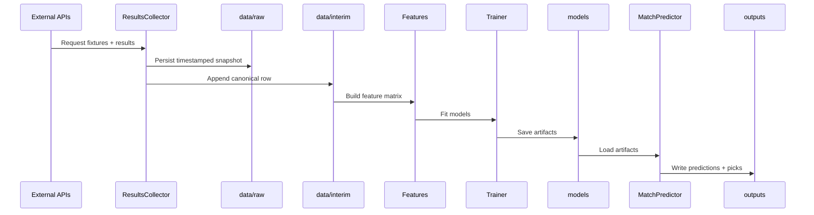

# Data flow

```mermaid
sequenceDiagram
  participant API as External APIs
  participant DC as ResultsCollector
  participant RAW as data/raw
  participant INT as data/interim
  participant FE as Features
  participant TR as Trainer
  participant MOD as models
  participant PR as MatchPredictor
  participant OUT as outputs

  API->>DC: Request fixtures + results
  DC->>RAW: Persist timestamped snapshot
  DC->>INT: Append canonical row
  INT->>FE: Build feature matrix
  FE->>TR: Fit models
  TR->>MOD: Save artifacts
  MOD->>PR: Load artifacts
  PR->>OUT: Write predictions + picks
```
