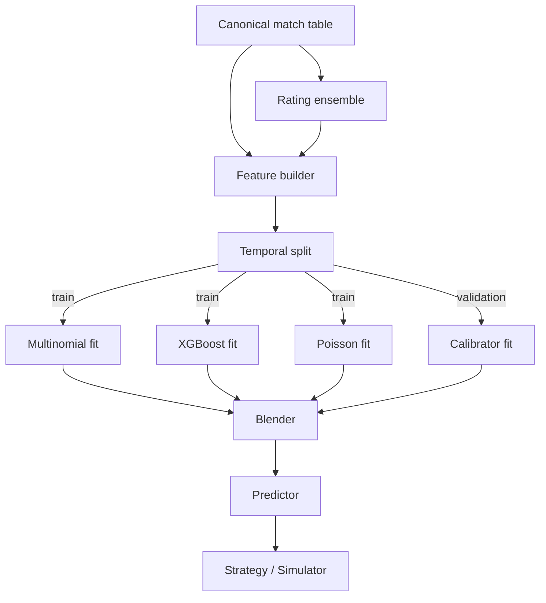

# Model pipeline

```mermaid
flowchart TD
  A[Canonical match table] --> B[Rating ensemble]
  A --> C[Feature builder]
  B --> C
  C --> D[Temporal split]
  D -->|train| E1[Multinomial fit]
  D -->|train| E2[XGBoost fit]
  D -->|train| E3[Poisson fit]
  D -->|validation| F[Calibrator fit]
  E1 --> G[Blender]
  E2 --> G
  E3 --> G
  F --> G
  G --> H[Predictor]
  H --> I[Strategy / Simulator]
```
