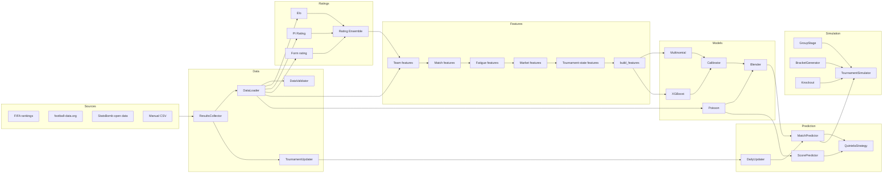

# System architecture (Mermaid)

```mermaid
flowchart LR
  subgraph Sources
    FIFA[FIFA rankings]
    FD[football-data.org]
    SB[StatsBomb open data]
    MAN[Manual CSV]
  end

  subgraph Data
    DC[ResultsCollector]
    DL[DataLoader]
    TU[TournamentUpdater]
    DV[DataValidator]
  end

  subgraph Ratings
    ELO[Elo]
    PI[PI Rating]
    FR[Form rating]
    RE[Rating Ensemble]
  end

  subgraph Features
    TF[Team features]
    MF[Match features]
    FF[Fatigue features]
    KF[Market features]
    SF[Tournament-state features]
    BF[build_features]
  end

  subgraph Models
    MN[Multinomial]
    XGB[XGBoost]
    POI[Poisson]
    CAL[Calibrator]
    BLN[Blender]
  end

  subgraph Prediction
    MP[MatchPredictor]
    SP[ScorePredictor]
    QS[QuinielaStrategy]
    DU[DailyUpdater]
  end

  subgraph Simulation
    GS[GroupStage]
    BR[BracketGenerator]
    KO[Knockout]
    TS[TournamentSimulator]
  end

  Sources --> DC
  DC --> DL
  DC --> TU
  DL --> DV
  DL --> ELO --> RE
  DL --> PI --> RE
  DL --> FR --> RE
  RE --> TF
  DL --> TF --> MF
  MF --> FF --> KF --> SF --> BF
  BF --> MN
  BF --> XGB
  DL --> POI
  MN --> CAL
  XGB --> CAL
  POI --> BLN
  CAL --> BLN
  BLN --> MP
  POI --> SP
  MP --> QS
  SP --> QS
  TU --> DU --> MP
  MP --> TS
  GS --> TS
  BR --> TS
  KO --> TS
```
